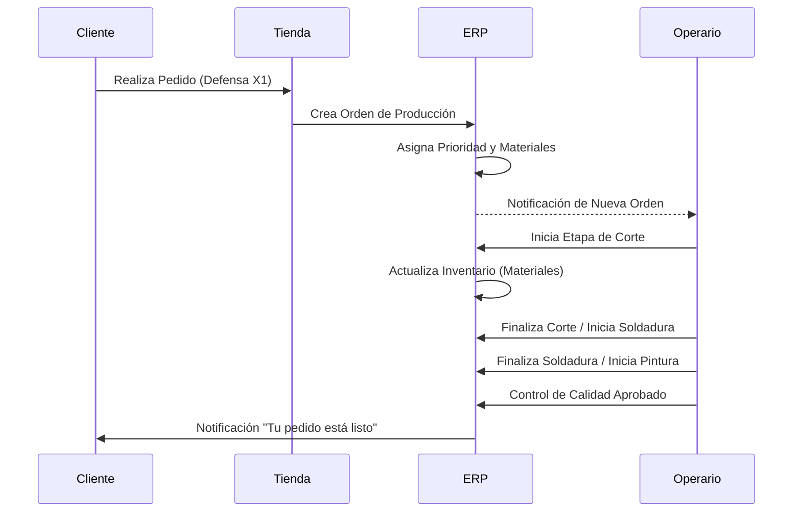

# XSafe ERP & Plataforma de E-commerce


## Resumen Ejecutivo

XSafe ERP es una plataforma de nivel empresarial diseñada para revolucionar la fabricación y venta de sistemas de protección para motocicletas. Este repositorio integra un ecosistema diverso de alto rendimiento:

*   **Tienda E-commerce**: Plataforma para el consumidor final basada en Next.js con visualización de productos en 3D.
*   **ERP Core**: Arquitectura de microservicios NestJS para la gestión de producción, inventario y logística.
*   **Administración Web**: Panel de control Next.js 14 para gestión global y análisis de datos.
*   **App Móvil Operarios**: Aplicación React Native offline-first para la gestión en planta.
*   **Estación de Trabajo Escritorio**: Aplicación Electron para integración con hardware especializado.

Construido con un enfoque en **escalabilidad**, **seguridad** y **confiabilidad**, XSafe ERP sigue estrictos estándares de cumplimiento ISO y utiliza tecnologías modernas nativas de la nube.

---

## Arquitectura del Sistema

El siguiente diagrama ilustra la interacción entre los diferentes dominios de la plataforma XSafe.

```mermaid
graph TB
    User((Usuario/Cliente))
    Admin((Admin/Gerente))
    Operator((Operario))
    
    subgraph "Ecosistema XSafe"
        Store[Tienda E-commerce\n(Next.js)]
        WebAdmin[Panel Web\n(Next.js)]
        ERP_API[API Core ERP\n(NestJS)]
        Mobile[App Móvil\n(React Native)]
        Desktop[App Escritorio\n(Electron)]
        DB[(PostgreSQL)]
        Redis[(Redis Cache)]
    end
    
    User -->|Compra| Store
    Admin -->|Gestiona| WebAdmin
    Operator -->|Produce| Mobile
    Operator -->|Controla| Desktop
    
    Store -->|Pedidos| ERP_API
    WebAdmin -->|Datos| ERP_API
    Mobile -->|Sincronización| ERP_API
    Desktop -->|Hardware| ERP_API
    
    ERP_API -->|Persistencia| DB
    ERP_API -->|Caché| Redis
```

## Flujo de Usuario (Producción)

Este diagrama detalla el ciclo de vida de una orden de producción desde la venta hasta la entrega.



---

## Stack Tecnológico

### Ecosistema Frontend
*   **Tienda Web**: Next.js 14, React 18, Tailwind CSS, Framer Motion
*   **Administración Web**: Next.js 14 App Router, NextAuth, Recharts
*   **Motor 3D**: Three.js, React Three Fiber, Drei
*   **Escritorio**: Electron 25, React, SQLite (Offline-First)
*   **Móvil**: React Native 0.72, TypeScript, SQLite (Modo Offline)

### Servicios Backend
*   **API Gateway**: NestJS, Fastify
*   **Base de Datos**: PostgreSQL (Prisma ORM), Redis (Caché)
*   **Mensajería**: RabbitMQ / Kafka (Event Driven)
*   **Autenticación**: JWT, OAuth2, Control de Acceso Basado en Roles (RBAC)

### Infraestructura y DevOps
*   **Contenedores**: Docker, Docker Compose
*   **Integración Continua**: GitHub Actions
*   **Monitoreo**: Prometheus, Grafana, Sentry

---

## Guía de Inicio Rápido

### Requisitos Previos
*   Node.js v20.x o superior
*   Docker y Docker Compose
*   PostgreSQL 15+

### Instalación Unificada
Proporcionamos un script unificado para iniciar todo el entorno:

```bash
# Clonar el repositorio
git clone https://github.com/Olymp-IA/xsafe.git
cd xsafe

# Instalar dependencias (Monorepo)
npm install

# Iniciar entorno de desarrollo (Servicios Docker + Apps)
npm run dev:all
```

Alternativamente, puede iniciar servicios específicos:

```bash
# Frontend (Tienda)
npm run dev:ecommerce

# Administración Web (ERP)
npm run dev:web

# Solo Backend
npm run dev:backend

# Móvil Android
npm run android

# App de Escritorio
npm run dev:desktop
```

---

## Índice de Documentación

Para información detallada, por favor consulte nuestra suite de documentación completa ubicada en `/documentation`. Toda la documentación se encuentra en español y sigue estándares corporativos.

*   [**Visión General de Arquitectura**](./documentation/ARCHITECTURE.md): Diseño del sistema, patrones y diagramas C4.
*   [**Referencia API**](./documentation/API_DOCUMENTATION.md): Especificaciones OpenAPI/Swagger y guía de endpoints.
*   [**Manual de Usuario**](./documentation/USER_MANUAL.md): Guías para usuarios de la Tienda y el ERP.
*   [**Guía del Desarrollador**](./documentation/DEVELOPER_GUIDE.md): Pautas de contribución y configuración.
*   [**Política de Seguridad**](./documentation/SECURITY.md): Modelos de autenticación y cumplimiento.
*   [**Guía de Despliegue**](./documentation/DEPLOYMENT_GUIDE.md): Estrategias de lanzamiento a producción.

---

## Soporte y Licencia

**Licencia**: MIT
**Soporte**: contact@xsafe.com
**Emergencias**: +1 800 XSAFE 99 (Soporte de Producción 24/7)

---
*Powered by OLYMP-IA Enterprise Solutions*
