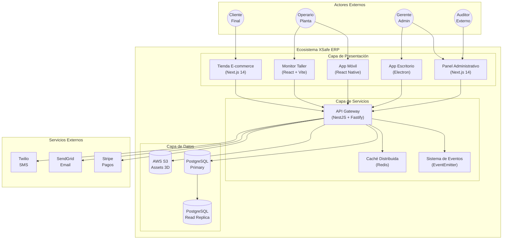
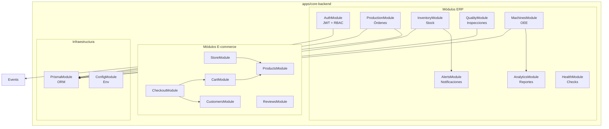
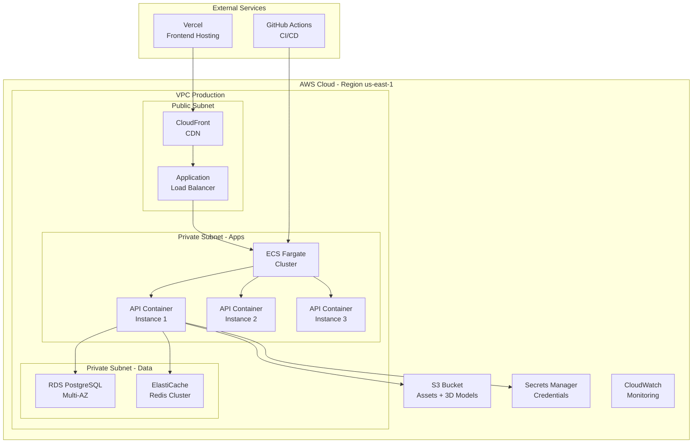
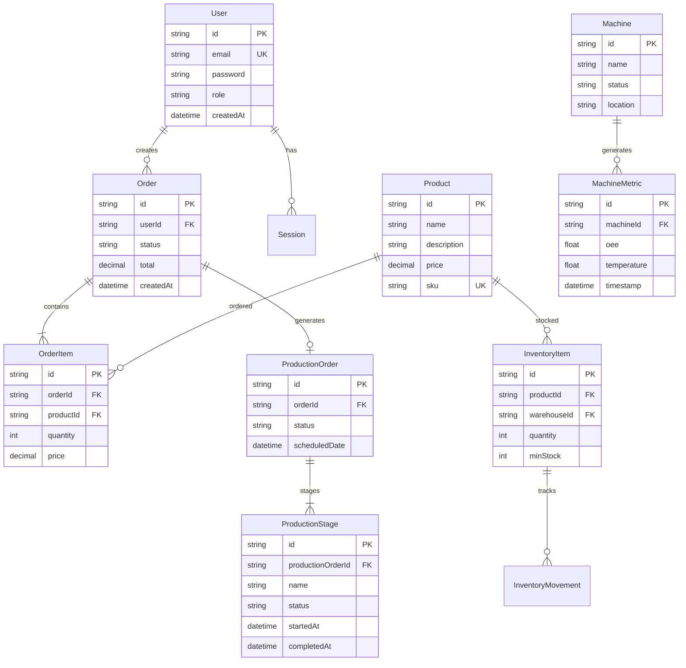

# Documento Maestro de Arquitectura del Sistema

**Documento ID:** DOC-ARCH-001  
**Versión:** 1.0.0  
**Clasificación:** CONFIDENCIAL  
**Fecha de Creación:** 2026-01-14  
**Última Revisión:** 2026-01-14  
**Estado:** APROBADO  

---

## 1.0 Información del Documento

### 1.1 Control de Versiones

| Versión | Fecha | Autor | Descripción |
|---------|-------|-------|-------------|
| 1.0.0 | 2026-01-14 | Arquitecto de Software Senior | Creación inicial |

### 1.2 Matriz de Aprobaciones

| Rol | Nombre | Firma Digital | Fecha |
|-----|--------|---------------|-------|
| Arquitecto de Documentación | - | Pendiente | - |
| Arquitecto de Software | - | Pendiente | - |
| Ingeniero de Sistemas | - | Pendiente | - |
| Especialista en Seguridad | - | Pendiente | - |

### 1.3 Distribución Controlada

| Copia | Destinatario | Nivel de Acceso |
|-------|--------------|-----------------|
| 001 | Dirección Técnica | COMPLETO |
| 002 | Equipo de Desarrollo | LECTURA |
| 003 | Operaciones | RESTRINGIDO |

---

## 2.0 Arquitectura de Alto Nivel

### 2.1 Vista de Contexto del Sistema

### 2.2 Vista Lógica (Diagrama de Componentes)

### 2.3 Vista Física (Diagrama de Despliegue)

---

## 3.0 Decisiones Arquitectónicas (ADRs)

### ADR-001: Selección de NestJS como Framework Backend

**Estado:** ACEPTADO  
**Fecha:** 2025-03-15  
**Contexto:** Necesidad de un framework backend robusto para aplicación empresarial con múltiples módulos.

**Decisión:** Adoptar NestJS con TypeScript.

**Justificación:**
1. Arquitectura modular nativa (facilita separación de dominios)
2. Inyección de dependencias integrada
3. Soporte nativo para Swagger/OpenAPI
4. Ecosistema maduro de plugins (Prisma, Cache, Auth)
5. TypeScript first (seguridad de tipos)

**Consecuencias:**
- (+) Código más mantenible y testeable
- (+) Documentación API automática
- (-) Curva de aprendizaje para desarrolladores sin experiencia en Angular-like

**Trazabilidad:** `apps/core-backend/src/main.ts:1-19`

---

### ADR-002: Prisma como ORM

**Estado:** ACEPTADO  
**Fecha:** 2025-03-15  
**Contexto:** Necesidad de acceso a datos con seguridad de tipos y migraciones controladas.

**Decisión:** Usar Prisma ORM sobre TypeORM o Sequelize.

**Justificación:**
1. Generación automática de tipos TypeScript desde schema
2. Sistema de migraciones robusto
3. Prisma Studio para debugging visual
4. Query engine optimizado
5. Soporte para PostgreSQL, MySQL, SQLite

**Consecuencias:**
- (+) Zero-runtime type safety
- (+) Migraciones declarativas
- (-) Menos flexibilidad que raw SQL para queries muy complejas

**Trazabilidad:** `apps/core-backend/src/shared/prisma/`

---

### ADR-003: Arquitectura Monorepo con NPM Workspaces

**Estado:** ACEPTADO  
**Fecha:** 2025-04-01  
**Contexto:** Múltiples aplicaciones (web, mobile, desktop) que comparten código.

**Decisión:** Estructura monorepo con `packages/` para código compartido.

**Justificación:**
1. Reutilización de componentes UI (`@xsafe/ui-kit`)
2. Tipos compartidos (`@xsafe/shared-types`)
3. Configuraciones centralizadas
4. Versiones sincronizadas entre apps

**Consecuencias:**
- (+) DRY (Don't Repeat Yourself)
- (+) Refactoring atómico cross-package
- (-) Builds más complejos
- (-) CI/CD requiere configuración específica

**Trazabilidad:** `package.json:workspaces`

---

### ADR-004: Autenticación JWT con Estrategia RBAC

**Estado:** ACEPTADO  
**Fecha:** 2025-03-20  
**Contexto:** Sistema multiusuario con diferentes niveles de acceso.

**Decisión:** JWT con roles embebidos + Guards de NestJS.

**Justificación:**
1. Stateless (escalabilidad horizontal)
2. Roles verificables sin consulta a BD
3. Refresh tokens para sesiones largas
4. Compatible con mobile/desktop offline

**Consecuencias:**
- (+) Alta escalabilidad
- (+) Sin sesiones en servidor
- (-) Tokens no revocables individualmente (mitigado con blacklist en Redis)

**Trazabilidad:** `apps/core-backend/src/modules/auth/`

---

### ADR-005: Patrón Offline-First para Aplicaciones Móvil/Desktop

**Estado:** ACEPTADO  
**Fecha:** 2025-05-10  
**Contexto:** Operarios trabajan en zonas con conectividad intermitente.

**Decisión:** SQLite local + SyncManager con cola de operaciones.

**Justificación:**
1. Operación sin conexión crítica para planta
2. Sincronización eventual con resolución de conflictos
3. Experiencia de usuario fluida

**Consecuencias:**
- (+) Productividad no bloqueada por red
- (-) Complejidad en resolución de conflictos
- (-) Datos potencialmente desactualizados

**Trazabilidad:** 
- `apps/erp-mobile/src/services/SyncManager.ts`
- `apps/erp-desktop/src/main/database.ts`

---

### ADR-006: Next.js 14 App Router para Frontends Web

**Estado:** ACEPTADO  
**Fecha:** 2025-04-15  
**Contexto:** Necesidad de SSR para SEO (e-commerce) y dashboard admin.

**Decisión:** Next.js 14 con App Router y Server Components.

**Justificación:**
1. SSR/SSG para SEO en tienda
2. Server Components para reducir JS en cliente
3. API Routes para BFF (Backend for Frontend)
4. Optimización automática de imágenes

**Consecuencias:**
- (+) Excelente performance y SEO
- (+) Ecosistema React completo
- (-) Complejidad de hidratación

**Trazabilidad:**
- `apps/ecommerce-frontend/`
- `apps/erp-web/`

---

### ADR-007: Event-Driven para Comunicación entre Módulos

**Estado:** ACEPTADO  
**Fecha:** 2025-05-01  
**Contexto:** Módulos desacoplados que necesitan reaccionar a eventos del sistema.

**Decisión:** EventEmitter de NestJS + patrón Observer.

**Justificación:**
1. Bajo acoplamiento entre módulos
2. Extensibilidad sin modificar código existente
3. Preparación para futura migración a message broker

**Consecuencias:**
- (+) Módulos independientes
- (+) Fácil agregar nuevos listeners
- (-) Debugging más complejo (tracing requerido)

**Trazabilidad:** `apps/core-backend/src/modules/production/events/`

---

### ADR-008: Vite para Aplicaciones SPA (Monitor, Desktop Renderer)

**Estado:** ACEPTADO  
**Fecha:** 2025-06-01  
**Contexto:** Apps que no requieren SSR pero sí performance en desarrollo.

**Decisión:** Vite en lugar de CRA para SPAs.

**Justificación:**
1. Hot Module Replacement ultrarrápido
2. Build optimizado con Rollup
3. Plugin ecosystem maduro
4. Configuración minimalista

**Consecuencias:**
- (+) DX (Developer Experience) superior
- (+) Builds más rápidos
- (-) Ecosistema diferente a Next.js (configuración duplicada)

**Trazabilidad:**
- `apps/workshop-monitor/vite.config.ts`
- `apps/erp-desktop/`

---

### ADR-009: Tailwind CSS como Sistema de Diseño Base

**Estado:** ACEPTADO  
**Fecha:** 2025-03-25  
**Contexto:** Necesidad de consistencia visual cross-platform.

**Decisión:** Tailwind CSS con preset compartido en `@xsafe/ui-kit`.

**Justificación:**
1. Utility-first acelera desarrollo
2. Consistencia mediante design tokens
3. Purge automático (bundles pequeños)
4. Compatible con todos los frameworks React

**Consecuencias:**
- (+) Desarrollo rápido
- (+) Bundle optimizado
- (-) HTML más verboso

**Trazabilidad:** `packages/ui-kit/src/theme.ts`

---

### ADR-010: Electron para App de Escritorio

**Estado:** ACEPTADO  
**Fecha:** 2025-05-15  
**Contexto:** Necesidad de app nativa con acceso a hardware local.

**Decisión:** Electron con proceso main/renderer separados.

**Justificación:**
1. Acceso a sistema de archivos
2. Integración con hardware (impresoras, escáneres)
3. Auto-updates nativas
4. Reutilización de código React

**Consecuencias:**
- (+) Capacidades nativas completas
- (-) Tamaño de bundle significativo (~150MB)
- (-) Consumo de memoria elevado

**Trazabilidad:** `apps/erp-desktop/`

---

## 4.0 Modelo de Datos

### 4.1 Diagrama Entidad-Relación

### 4.2 Diccionario de Datos

| Tabla | Campo | Tipo | Restricciones | Descripción |
|-------|-------|------|---------------|-------------|
| `User` | `id` | UUID | PK, NOT NULL | Identificador único |
| `User` | `email` | VARCHAR(255) | UK, NOT NULL | Email de acceso |
| `User` | `password` | VARCHAR(255) | NOT NULL | Hash bcrypt |
| `User` | `role` | ENUM | NOT NULL | ADMIN, MANAGER, OPERATOR, CUSTOMER |
| `Order` | `status` | ENUM | NOT NULL | PENDING, PROCESSING, SHIPPED, DELIVERED, CANCELLED |
| `ProductionOrder` | `status` | ENUM | NOT NULL | SCHEDULED, IN_PROGRESS, COMPLETED, ON_HOLD |
| `Machine` | `status` | ENUM | NOT NULL | ACTIVE, WARNING, ERROR, OFFLINE |

---

## 5.0 Patrones de Diseño Implementados

### 5.1 Patrones Estructurales

| Patrón | Ubicación | Propósito |
|--------|-----------|-----------|
| **Repository** | `**/repositories/` | Abstracción de acceso a datos |
| **Module** | `**/modules/` | Encapsulación de dominios |
| **Facade** | `**/services/` | Simplificación de interfaces complejas |

### 5.2 Patrones de Comportamiento

| Patrón | Ubicación | Propósito |
|--------|-----------|-----------|
| **Observer** | `events/` | Comunicación desacoplada |
| **Strategy** | `guards/` | Estrategias de autenticación |
| **Command** | `SyncManager.ts` | Operaciones encolables |

### 5.3 Patrones de Creación

| Patrón | Ubicación | Propósito |
|--------|-----------|-----------|
| **Factory** | `NestFactory.create()` | Creación de instancia de app |
| **Singleton** | `PrismaService` | Instancia única de conexión |

---

## 6.0 Requisitos No Funcionales

### 6.1 Rendimiento

| Métrica | Objetivo | Medición |
|---------|----------|----------|
| Tiempo de respuesta API | < 200ms (P95) | Datadog APM |
| Throughput | > 1000 req/s | Load testing |
| Time to First Byte (TTFB) | < 500ms | Lighthouse |

### 6.2 Disponibilidad

| Métrica | Objetivo |
|---------|----------|
| Uptime | 99.9% (8.76h downtime/año) |
| RTO | < 4 horas |
| RPO | < 1 hora |

### 6.3 Escalabilidad

| Escenario | Estrategia |
|-----------|------------|
| Picos de tráfico | Auto-scaling ECS |
| Crecimiento de datos | Read replicas PostgreSQL |
| Archivos grandes | S3 con CloudFront CDN |

---

## 7.0 Trazabilidad de Código

| Componente | Ruta en Código |
|------------|----------------|
| Entry Point Backend | `apps/core-backend/src/main.ts` |
| App Module | `apps/core-backend/src/app.module.ts` |
| Auth Module | `apps/core-backend/src/modules/auth/` |
| Production Module | `apps/core-backend/src/modules/production/` |
| Prisma Schema | `apps/core-backend/prisma/schema.prisma` |
| UI Kit | `packages/ui-kit/src/` |
| Shared Types | `packages/shared-types/` |

---

*Este documento cumple con los estándares ISO/IEC/IEEE 42010:2011 para descripción de arquitectura.*
