# Especificación de Casos de Uso

**Documento ID:** DOC-UC-001  
**Versión:** 1.0.0  
**Clasificación:** INTERNO  
**Fecha:** 2026-01-14  

---

## Índice de Casos de Uso

| ID | Nombre | Actor Principal | Módulo |
|----|--------|-----------------|--------|
| CU-AUTH-001 | Iniciar Sesión | Usuario | Auth |
| CU-AUTH-002 | Registrar Usuario | Administrador | Auth |
| CU-AUTH-003 | Refrescar Token | Sistema | Auth |
| CU-PROD-001 | Crear Orden de Producción | Gerente | Production |
| CU-PROD-002 | Actualizar Etapa de Producción | Operario | Production |
| CU-PROD-003 | Consultar Estado de Orden | Usuario | Production |
| CU-INV-001 | Registrar Movimiento de Inventario | Operario | Inventory |
| CU-INV-002 | Consultar Stock | Usuario | Inventory |
| CU-QC-001 | Registrar Inspección de Calidad | Supervisor | Quality |
| CU-ECOM-001 | Agregar Producto al Carrito | Cliente | E-commerce |
| CU-ECOM-002 | Procesar Checkout | Cliente | E-commerce |
| CU-ECOM-003 | Consultar Historial de Pedidos | Cliente | E-commerce |

---

## CU-AUTH-001: Iniciar Sesión

**Versión:** 1.0 | **Fecha:** 2026-01-14 | **Estado:** APROBADO  
**Clasificación:** INTERNO

### 1. Resumen Ejecutivo
Permite a un usuario autenticarse en el sistema mediante credenciales (email/contraseña) para obtener acceso a las funcionalidades según su rol.

### 2. Actores
- **Actor Principal:** Usuario (cualquier rol)
- **Actores Secundarios:** Sistema de Autenticación
- **Sistemas Externos:** N/A

### 3. Precondiciones Verificables
- PRE-01: El usuario debe estar registrado en el sistema
- PRE-02: La cuenta del usuario debe estar activa (no bloqueada)
- PRE-03: El servicio de base de datos debe estar disponible

### 4. Flujo Principal

| Paso | Actor | Acción | Sistema |
|------|-------|--------|---------|
| 4.1 | Usuario | Navega a la pantalla de login | Muestra formulario de login |
| 4.2 | Usuario | Ingresa email y contraseña | - |
| 4.3 | Usuario | Presiona botón "Iniciar Sesión" | - |
| 4.4 | - | - | Valida formato de email (Zod) |
| 4.5 | - | - | Busca usuario por email en BD |
| 4.6 | - | - | Compara hash de contraseña (bcrypt) |
| 4.7 | - | - | Genera JWT con payload {userId, role, exp} |
| 4.8 | - | - | Genera Refresh Token |
| 4.9 | - | - | Almacena sesión en Redis |
| 4.10 | - | - | Retorna {accessToken, refreshToken, user} |
| 4.11 | Usuario | Recibe tokens y es redirigido | Redirige según rol |

### 5. Flujos Alternativos

**5A. Email no encontrado**
| Paso | Acción |
|------|--------|
| 5A.1 | En paso 4.5, usuario no existe |
| 5A.2 | Sistema retorna error 401: "Credenciales inválidas" |
| 5A.3 | Sistema registra intento fallido en log |
| 5A.4 | Continúa en paso 4.1 |

**5B. Contraseña incorrecta**
| Paso | Acción |
|------|--------|
| 5B.1 | En paso 4.6, hash no coincide |
| 5B.2 | Sistema incrementa contador de intentos fallidos |
| 5B.3 | Si intentos >= 5, bloquea cuenta por 15 minutos |
| 5B.4 | Retorna error 401: "Credenciales inválidas" |

**5C. Cuenta bloqueada**
| Paso | Acción |
|------|--------|
| 5C.1 | Sistema detecta cuenta bloqueada |
| 5C.2 | Retorna error 403: "Cuenta temporalmente bloqueada" |
| 5C.3 | Incluye tiempo restante de bloqueo |

### 6. Manejo de Excepciones

| Código | Excepción | Acción de Recuperación |
|--------|-----------|------------------------|
| 401 | INVALID_CREDENTIALS | Mostrar mensaje, permitir reintento |
| 403 | ACCOUNT_LOCKED | Mostrar tiempo de espera |
| 503 | SERVICE_UNAVAILABLE | Mostrar mensaje de mantenimiento |

### 7. Postcondiciones
- POST-01: Usuario tiene JWT válido almacenado
- POST-02: Sesión registrada en Redis con TTL
- POST-03: Evento `user.logged_in` emitido

### 8. Reglas de Negocio Asociadas

| ID | Regla | Código Fuente |
|----|-------|---------------|
| RN-AUTH-001 | JWT expira en 15 minutos | `auth.service.ts:42` |
| RN-AUTH-002 | Refresh token expira en 7 días | `auth.service.ts:45` |
| RN-AUTH-003 | Máximo 5 intentos fallidos | `auth.service.ts:60` |
| RN-AUTH-004 | Bloqueo de 15 minutos tras exceder intentos | `auth.service.ts:65` |

### 9. Trazabilidad

| Elemento | Ubicación |
|----------|-----------|
| Controller | `modules/auth/auth.controller.ts:login()` |
| Service | `modules/auth/auth.service.ts:validateUser()` |
| DTO | `modules/auth/dto/login.dto.ts` |
| Guard | `modules/auth/guards/local.guard.ts` |
| Test | `modules/auth/auth.service.spec.ts` |

---

## CU-PROD-001: Crear Orden de Producción

**Versión:** 1.0 | **Fecha:** 2026-01-14 | **Estado:** APROBADO  
**Clasificación:** INTERNO

### 1. Resumen Ejecutivo
Permite a un gerente crear una nueva orden de producción basada en un pedido de cliente o proyección de inventario.

### 2. Actores
- **Actor Principal:** Gerente
- **Actores Secundarios:** Sistema de Inventario, Sistema de Producción
- **Sistemas Externos:** N/A

### 3. Precondiciones Verificables
- PRE-01: Usuario autenticado con rol MANAGER o ADMIN
- PRE-02: Productos a producir existen en catálogo
- PRE-03: Materias primas disponibles en inventario (al menos 80%)

### 4. Flujo Principal

| Paso | Actor | Acción | Sistema |
|------|-------|--------|---------|
| 4.1 | Gerente | Accede a "Nueva Orden de Producción" | Muestra formulario |
| 4.2 | Gerente | Selecciona producto(s) a producir | Carga BOM (Bill of Materials) |
| 4.3 | Gerente | Ingresa cantidad | Calcula materiales requeridos |
| 4.4 | Sistema | - | Verifica disponibilidad de materiales |
| 4.5 | Gerente | Selecciona fecha programada | Valida capacidad de planta |
| 4.6 | Gerente | Asigna prioridad (ALTA/MEDIA/BAJA) | - |
| 4.7 | Gerente | Confirma creación | - |
| 4.8 | Sistema | - | Crea registro ProductionOrder |
| 4.9 | Sistema | - | Genera etapas automáticas |
| 4.10 | Sistema | - | Reserva materiales en inventario |
| 4.11 | Sistema | - | Emite evento `production.order.created` |
| 4.12 | Sistema | - | Notifica a operarios asignados |

### 5. Flujos Alternativos

**5A. Materiales insuficientes**
| Paso | Acción |
|------|--------|
| 5A.1 | En paso 4.4, stock < 80% |
| 5A.2 | Sistema muestra alerta con faltantes |
| 5A.3 | Gerente puede: a) Crear orden parcial, b) Cancelar, c) Generar orden de compra |

**5B. Capacidad excedida**
| Paso | Acción |
|------|--------|
| 5B.1 | En paso 4.5, fecha con capacidad al 100% |
| 5B.2 | Sistema sugiere fechas alternativas |
| 5B.3 | Gerente selecciona nueva fecha o fuerza asignación |

### 6. Manejo de Excepciones

| Código | Excepción | Acción de Recuperación |
|--------|-----------|------------------------|
| 400 | INVALID_PRODUCT | Verificar catálogo de productos |
| 409 | INSUFFICIENT_MATERIALS | Mostrar faltantes, opciones de acción |
| 503 | INVENTORY_SERVICE_DOWN | Reintentar o crear orden sin reserva |

### 7. Postcondiciones
- POST-01: Orden de producción creada en estado SCHEDULED
- POST-02: Etapas de producción generadas
- POST-03: Materiales reservados (soft lock)
- POST-04: Notificaciones enviadas a operarios

### 8. Reglas de Negocio Asociadas

| ID | Regla | Código Fuente |
|----|-------|---------------|
| RN-PROD-001 | Orden requiere mínimo 1 producto | `production.service.ts:25` |
| RN-PROD-002 | Fecha programada >= hoy + 1 día hábil | `production.service.ts:30` |
| RN-PROD-003 | Prioridad ALTA requiere aprobación gerencial | `production.service.ts:35` |
| RN-PROD-004 | Capacidad máxima por día: 50 órdenes | `production.service.ts:40` |

### 9. Trazabilidad

| Elemento | Ubicación |
|----------|-----------|
| Controller | `modules/production/production.controller.ts:create()` |
| Service | `modules/production/production.service.ts:createOrder()` |
| DTO | `modules/production/dto/create-order.dto.ts` |
| Event | `modules/production/events/order-created.event.ts` |
| Test | `modules/production/production.service.spec.ts` |

---

## CU-ECOM-002: Procesar Checkout

**Versión:** 1.0 | **Fecha:** 2026-01-14 | **Estado:** APROBADO  
**Clasificación:** CONFIDENCIAL

### 1. Resumen Ejecutivo
Permite a un cliente completar la compra de los productos en su carrito, procesando el pago y generando el pedido.

### 2. Actores
- **Actor Principal:** Cliente
- **Actores Secundarios:** Sistema de Pagos (Stripe)
- **Sistemas Externos:** Stripe API, SendGrid

### 3. Precondiciones Verificables
- PRE-01: Cliente autenticado
- PRE-02: Carrito con al menos 1 producto
- PRE-03: Productos en carrito con stock disponible
- PRE-04: Servicio Stripe disponible

### 4. Flujo Principal

| Paso | Actor | Acción | Sistema |
|------|-------|--------|---------|
| 4.1 | Cliente | Accede a Checkout | Carga resumen del carrito |
| 4.2 | Sistema | - | Verifica stock actual de items |
| 4.3 | Cliente | Ingresa/selecciona dirección de envío | Calcula costos de envío |
| 4.4 | Cliente | Selecciona método de pago | Muestra opciones (Tarjeta, PayPal) |
| 4.5 | Cliente | Ingresa datos de tarjeta | Tokeniza con Stripe.js |
| 4.6 | Cliente | Confirma compra | - |
| 4.7 | Sistema | - | Crea PaymentIntent en Stripe |
| 4.8 | Sistema | - | Stripe procesa cobro |
| 4.9 | Sistema | - | Recibe confirmación de Stripe |
| 4.10 | Sistema | - | Crea Order en base de datos |
| 4.11 | Sistema | - | Decrementa stock de productos |
| 4.12 | Sistema | - | Limpia carrito del cliente |
| 4.13 | Sistema | - | Genera número de orden |
| 4.14 | Sistema | - | Envía email de confirmación |
| 4.15 | Sistema | - | Muestra página de éxito |

### 5. Flujos Alternativos

**5A. Pago rechazado**
| Paso | Acción |
|------|--------|
| 5A.1 | En paso 4.8, Stripe rechaza tarjeta |
| 5A.2 | Sistema muestra error específico (fondos, expirada, etc.) |
| 5A.3 | Cliente puede reintentar con otra tarjeta |

**5B. Stock insuficiente durante checkout**
| Paso | Acción |
|------|--------|
| 5B.1 | En paso 4.2, producto sin stock |
| 5B.2 | Sistema muestra alerta |
| 5B.3 | Cliente debe ajustar carrito |

**5C. Timeout de Stripe**
| Paso | Acción |
|------|--------|
| 5C.1 | En paso 4.7, timeout de 30 segundos |
| 5C.2 | Sistema registra intento pendiente |
| 5C.3 | Muestra mensaje de "procesando" |
| 5C.4 | Webhook de Stripe confirma posteriormente |

### 6. Manejo de Excepciones

| Código | Excepción | Acción de Recuperación |
|--------|-----------|------------------------|
| 400 | EMPTY_CART | Redirigir a tienda |
| 402 | PAYMENT_FAILED | Mostrar razón, permitir reintento |
| 409 | STOCK_CHANGED | Actualizar carrito, mostrar cambios |
| 503 | PAYMENT_SERVICE_DOWN | Mostrar mensaje, guardar pedido como pendiente |

### 7. Postcondiciones
- POST-01: Orden creada con estado PAID
- POST-02: Pago registrado en Stripe
- POST-03: Stock actualizado
- POST-04: Email de confirmación enviado
- POST-05: Carrito vacío

### 8. Reglas de Negocio Asociadas

| ID | Regla | Código Fuente |
|----|-------|---------------|
| RN-ECOM-001 | Monto mínimo de compra: $10.000 CLP | `checkout.service.ts:15` |
| RN-ECOM-002 | Envío gratis sobre $50.000 CLP | `checkout.service.ts:20` |
| RN-ECOM-003 | IVA incluido (19%) | `checkout.service.ts:25` |
| RN-ECOM-004 | Reserva de stock por 15 minutos durante checkout | `checkout.service.ts:30` |

### 9. Trazabilidad

| Elemento | Ubicación |
|----------|-----------|
| Controller | `modules/ecommerce/checkout/checkout.controller.ts` |
| Service | `modules/ecommerce/checkout/checkout.service.ts` |
| Stripe Integration | `modules/ecommerce/checkout/stripe.service.ts` |
| Email Template | `templates/email/order-confirmation.hbs` |
| Test | `modules/ecommerce/checkout/checkout.service.spec.ts` |

---

## Diagrama de Casos de Uso

```mermaid
graph TB
    subgraph "Sistema XSafe ERP"
        subgraph "Autenticación"
            UC1["CU-AUTH-001<br>Iniciar Sesión"]
            UC2["CU-AUTH-002<br>Registrar Usuario"]
            UC3["CU-AUTH-003<br>Refrescar Token"]
        end
        
        subgraph "Producción"
            UC4["CU-PROD-001<br>Crear Orden"]
            UC5["CU-PROD-002<br>Actualizar Etapa"]
            UC6["CU-PROD-003<br>Consultar Estado"]
        end
        
        subgraph "Inventario"
            UC7["CU-INV-001<br>Registrar Movimiento"]
            UC8["CU-INV-002<br>Consultar Stock"]
        end
        
        subgraph "E-commerce"
            UC10["CU-ECOM-001<br>Agregar al Carrito"]
            UC11["CU-ECOM-002<br>Procesar Checkout"]
            UC12["CU-ECOM-003<br>Historial Pedidos"]
        end
    end
    
    Cliente(("Cliente"))
    Operario(("Operario"))
    Gerente(("Gerente"))
    Admin(("Admin"))
    
    Cliente --> UC1
    Cliente --> UC10
    Cliente --> UC11
    Cliente --> UC12
    
    Operario --> UC1
    Operario --> UC5
    Operario --> UC6
    Operario --> UC7
    Operario --> UC8
    
    Gerente --> UC1
    Gerente --> UC4
    Gerente --> UC6
    Gerente --> UC8
    
    Admin --> UC2
    Admin --> UC1
```

---

*Este documento cumple con el estándar IEEE 830-1998 para especificación de requisitos de software.*
