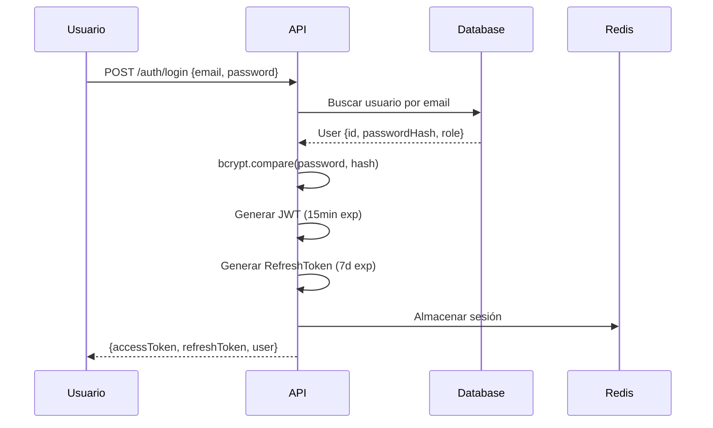
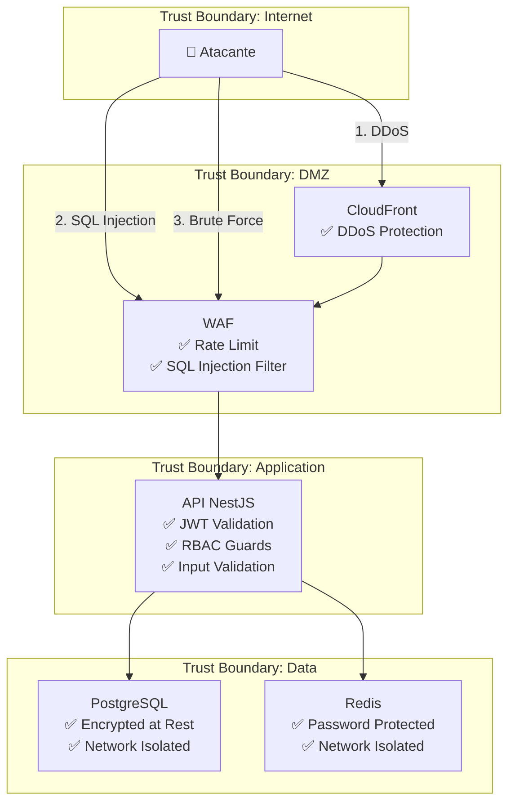
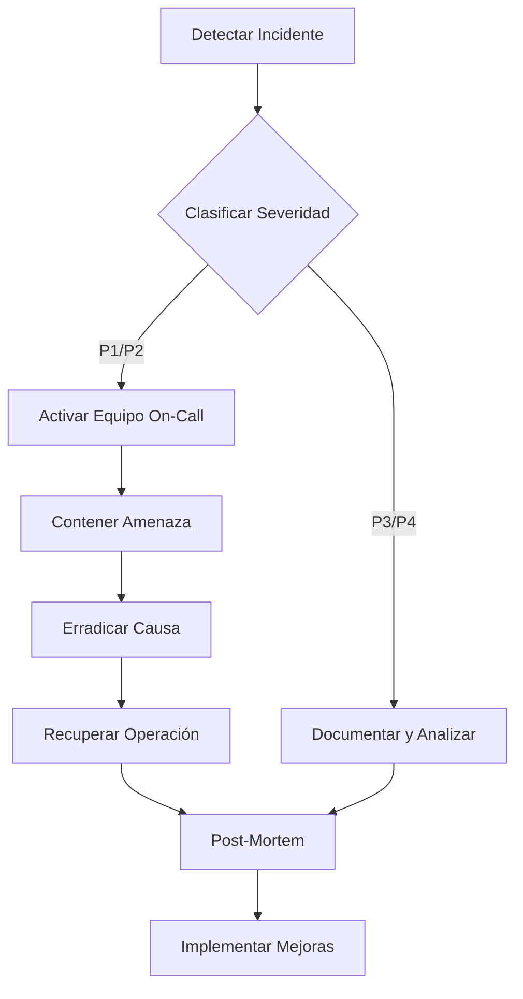

# Documento de Seguridad

**Documento ID:** DOC-SEC-001  
**Versión:** 1.0.0  
**Clasificación:** CONFIDENCIAL  
**Fecha:** 2026-01-14  

---

## 1. Modelo de Seguridad

### 1.1 Principios de Seguridad

| Principio | Implementación |
|-----------|----------------|
| **Defensa en Profundidad** | Múltiples capas: WAF → ALB → App → DB |
| **Mínimo Privilegio** | RBAC con roles granulares |
| **Seguridad por Diseño** | Validación en todas las capas |
| **Fail Secure** | Errores no exponen información sensible |
| **Separación de Responsabilidades** | Datos sensibles aislados |

### 1.2 Clasificación de Datos

| Clasificación | Tipo de Datos | Controles |
|---------------|---------------|-----------|
| **CONFIDENCIAL** | Contraseñas, tokens, claves API | Encriptación, no logging |
| **INTERNO** | Datos de negocio, métricas | Acceso autenticado |
| **PÚBLICO** | Catálogo de productos | Sin restricción |

---

## 2. Autenticación y Autorización

### 2.1 Mecanismo de Autenticación



### 2.2 Estructura del JWT

```json
{
  "header": {
    "alg": "HS256",
    "typ": "JWT"
  },
  "payload": {
    "sub": "user-uuid",
    "email": "user@example.com",
    "role": "OPERATOR",
    "iat": 1705200000,
    "exp": 1705200900
  }
}
```

### 2.3 Roles y Permisos (RBAC)

| Rol | Permisos | Acceso a Módulos |
|-----|----------|------------------|
| **ADMIN** | Full access | Todos |
| **MANAGER** | CRUD producción, lectura analytics | Production, Inventory, Quality, Analytics |
| **OPERATOR** | Actualizar estados, registros | Production, Inventory |
| **SUPERVISOR** | QC, inspecciones | Quality, Production (lectura) |
| **CUSTOMER** | Tienda online | E-commerce |

### 2.4 Matriz de Acceso por Endpoint

| Endpoint | ADMIN | MANAGER | OPERATOR | CUSTOMER | Público |
|----------|-------|---------|----------|----------|---------|
| `POST /auth/login` | ✅ | ✅ | ✅ | ✅ | ✅ |
| `POST /auth/register` | ✅ | ❌ | ❌ | ❌ | ❌ |
| `GET /production/orders` | ✅ | ✅ | ✅ | ❌ | ❌ |
| `POST /production/orders` | ✅ | ✅ | ❌ | ❌ | ❌ |
| `GET /products` | ✅ | ✅ | ✅ | ✅ | ✅ |
| `POST /checkout` | ✅ | ❌ | ❌ | ✅ | ❌ |
| `GET /analytics/*` | ✅ | ✅ | ❌ | ❌ | ❌ |

---

## 3. Modelo de Amenazas (STRIDE)

### 3.1 Análisis STRIDE

| Amenaza | Descripción | Control Implementado | Riesgo Residual |
|---------|-------------|----------------------|-----------------|
| **S**poofing | Suplantación de identidad | JWT + MFA (opcional) | BAJO |
| **T**ampering | Modificación de datos | Validación Zod, Prisma parameterized | BAJO |
| **R**epudiation | Negación de acciones | Audit logs en todas las operaciones | BAJO |
| **I**nformation Disclosure | Fuga de información | HTTPS, respuestas sanitizadas | MEDIO |
| **D**enial of Service | Denegación de servicio | Rate limiting, WAF | MEDIO |
| **E**levation of Privilege | Escalada de privilegios | RBAC estricto, Guards | BAJO |

### 3.2 Diagrama de Amenazas



---

## 4. Controles de Seguridad Implementados

### 4.1 Seguridad en Tránsito

| Control | Tecnología | Configuración |
|---------|------------|---------------|
| HTTPS | TLS 1.3 | Forzado en todos los endpoints |
| HSTS | Header | `max-age=31536000; includeSubDomains` |
| Certificate | ACM | Auto-renovación |

### 4.2 Seguridad en Reposo

| Dato | Método de Encriptación | Gestión de Claves |
|------|------------------------|-------------------|
| Base de datos | AES-256 (RDS) | AWS managed |
| Contraseñas | bcrypt (cost 12) | N/A (hash) |
| Secrets | Secrets Manager | AWS KMS |
| Backups | AES-256 (S3 SSE) | AWS managed |

### 4.3 Protección contra Vulnerabilidades Comunes

| Vulnerabilidad | Control | Código Referencia |
|----------------|---------|-------------------|
| **SQL Injection** | Prisma ORM (parameterized) | Todas las queries |
| **XSS** | CSP headers, React escaping | `next.config.js` |
| **CSRF** | SameSite cookies, tokens | `auth.module.ts` |
| **IDOR** | Ownership checks en servicios | `*.service.ts` |
| **Mass Assignment** | DTOs con class-validator | `dto/*.dto.ts` |
| **Brute Force** | Rate limiting (5/min login) | `auth.controller.ts` |

### 4.4 Headers de Seguridad

```typescript
// Configuración en NestJS
app.use(helmet({
  contentSecurityPolicy: {
    directives: {
      defaultSrc: ["'self'"],
      styleSrc: ["'self'", "'unsafe-inline'"],
      imgSrc: ["'self'", "data:", "https:"],
      scriptSrc: ["'self'"],
    },
  },
  hsts: { maxAge: 31536000, includeSubDomains: true },
  noSniff: true,
  referrerPolicy: { policy: 'strict-origin-when-cross-origin' },
}));
```

---

## 5. Auditoría y Logging

### 5.1 Eventos de Auditoría

| Evento | Datos Registrados | Retención |
|--------|-------------------|-----------|
| Login exitoso | userId, IP, userAgent, timestamp | 90 días |
| Login fallido | email intento, IP, razón | 90 días |
| Creación de orden | userId, orderId, datos | 7 años |
| Cambio de estado | userId, entityId, oldValue, newValue | 7 años |
| Acceso a datos sensibles | userId, recurso, acción | 7 años |

### 5.2 Formato de Log

```json
{
  "timestamp": "2026-01-14T05:40:00.000Z",
  "level": "info",
  "event": "AUTH_LOGIN_SUCCESS",
  "userId": "uuid-here",
  "ip": "192.168.1.100",
  "userAgent": "Mozilla/5.0...",
  "requestId": "req-uuid",
  "duration": 150
}
```

### 5.3 Log Sanitization

**Datos NUNCA loggeados:**
- Contraseñas (planas o hashed)
- Tokens JWT completos
- Números de tarjeta
- CVV, fechas de expiración
- Datos personales sensibles (RUT, teléfonos completos)

---

## 6. Gestión de Secretos

### 6.1 Inventario de Secretos

| Secreto | Ubicación | Rotación |
|---------|-----------|----------|
| `DATABASE_URL` | Secrets Manager | 90 días |
| `JWT_SECRET` | Secrets Manager | 30 días |
| `STRIPE_API_KEY` | Secrets Manager | Manual |
| `SENDGRID_API_KEY` | Secrets Manager | Manual |
| `REDIS_PASSWORD` | Secrets Manager | 90 días |

### 6.2 Política de Rotación

```yaml
# Automatización con AWS Secrets Manager
rotation:
  - secret: DATABASE_URL
    schedule: rate(90 days)
    lambda: rds-password-rotator
  - secret: JWT_SECRET
    schedule: rate(30 days)
    lambda: jwt-secret-rotator
```

---

## 7. Cumplimiento Normativo

### 7.1 Estándares Cumplidos

| Estándar | Estado | Evidencia |
|----------|--------|-----------|
| **ISO 27001:2022** | Parcial | Controles documentados |
| **PCI-DSS v4.0** | No aplica | Pagos delegados a Stripe |
| **GDPR** | Parcial | Política de privacidad |
| **Ley 19.628 (Chile)** | Completo | Consentimiento, derechos |

### 7.2 Checklist de Cumplimiento

- [x] Encriptación en tránsito (HTTPS)
- [x] Encriptación en reposo (RDS, S3)
- [x] Gestión de accesos (RBAC)
- [x] Auditoría de acciones
- [x] Política de contraseñas (mínimo 8 caracteres, complejidad)
- [x] Bloqueo por intentos fallidos
- [x] Backups automáticos
- [ ] MFA para administradores (pendiente)
- [ ] Penetration testing anual (pendiente)

---

## 8. Respuesta a Incidentes

### 8.1 Clasificación de Incidentes

| Severidad | Descripción | Tiempo de Respuesta |
|-----------|-------------|---------------------|
| **P1 - Crítico** | Brecha de datos, sistema caído | < 15 minutos |
| **P2 - Alto** | Vulnerabilidad explotable | < 1 hora |
| **P3 - Medio** | Intento de ataque bloqueado | < 4 horas |
| **P4 - Bajo** | Anomalía detectada | < 24 horas |

### 8.2 Procedimiento de Respuesta



### 8.3 Contactos de Emergencia

| Rol | Nombre | Teléfono | Email |
|-----|--------|----------|-------|
| Security Lead | [Pendiente] | [Pendiente] | security@xsafe.com |
| DevOps On-Call | [Pendiente] | [Pendiente] | oncall@xsafe.com |
| CTO | [Pendiente] | [Pendiente] | cto@xsafe.com |

---

## 9. Trazabilidad

| Control | Ubicación en Código |
|---------|---------------------|
| JWT Guards | `apps/core-backend/src/modules/auth/guards/` |
| RBAC Decorators | `apps/core-backend/src/modules/auth/decorators/` |
| Password Hashing | `apps/core-backend/src/modules/auth/auth.service.ts` |
| Audit Logging | `apps/core-backend/src/shared/interceptors/audit.interceptor.ts` |
| Rate Limiting | `apps/core-backend/src/app.module.ts` (ThrottlerModule) |

---

*Este documento cumple con ISO/IEC 27001:2022 - Anexo A*
