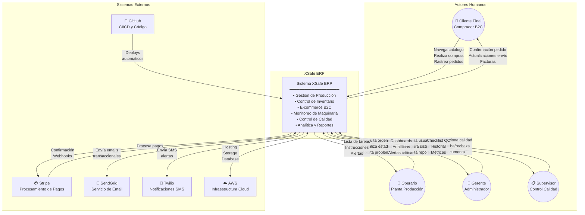

# Diagrama de Contexto del Sistema

**Documento ID:** UML-CTX-001  
**Versión:** 1.0.0  
**Clasificación:** INTERNO  
**Fecha:** 2026-01-14  

---

## Descripción

El Diagrama de Contexto muestra el sistema XSafe ERP como una caja negra, identificando todos los actores externos y sistemas con los que interactúa.

## Diagrama



## Actores del Sistema

### Actores Primarios

| Actor | Rol | Frecuencia de Uso | Nivel de Acceso |
|-------|-----|-------------------|-----------------|
| **Cliente Final** | Comprador B2C | Alta (diario) | Solo tienda pública |
| **Operario** | Producción/Planta | Alta (tiempo completo) | Módulos operativos |
| **Gerente** | Administración | Media (diario) | Acceso completo |
| **Supervisor** | Control de Calidad | Media (por turno) | Módulos de calidad |

### Sistemas Externos

| Sistema | Propósito | Protocolo | SLA |
|---------|-----------|-----------|-----|
| **Stripe** | Pagos online | API REST + Webhooks | 99.99% |
| **SendGrid** | Email transaccional | API REST | 99.95% |
| **Twilio** | SMS alertas | API REST | 99.95% |
| **AWS** | Infraestructura | Múltiple | 99.99% |
| **GitHub** | CI/CD | Webhooks + Actions | 99.95% |

## Flujos de Datos Principales

### Flujo 1: Compra E-commerce
```
Cliente → [Navega Catálogo] → Sistema → [Consulta Stock] → Inventario
Cliente → [Agrega al Carrito] → Sistema
Cliente → [Checkout] → Sistema → [Procesa Pago] → Stripe
Stripe → [Confirmación] → Sistema → [Crea Orden] → Base de Datos
Sistema → [Envía Confirmación] → SendGrid → Cliente
```

### Flujo 2: Producción de Orden
```
Sistema → [Genera Orden Producción] → Cola de Trabajo
Operario → [Consulta Tareas] → Sistema
Operario → [Inicia Producción] → Sistema → [Actualiza Estado] → DB
Operario → [Completa Etapa] → Sistema → [Dispara Evento]
Sistema → [Notifica Siguiente Estación] → Monitor Taller
```

### Flujo 3: Monitoreo de Maquinaria
```
Máquina → [Envía Métricas] → Sistema → [Procesa OEE] → Analytics
Sistema → [Detecta Anomalía] → AlertsModule
AlertsModule → [Notifica] → Twilio → Supervisor SMS
AlertsModule → [Actualiza Dashboard] → Monitor Taller
```

---

## Trazabilidad

| Elemento | Ubicación en Código |
|----------|---------------------|
| Integración Stripe | `apps/core-backend/src/modules/ecommerce/checkout/` |
| Servicio Email | `apps/core-backend/src/shared/email/` |
| Módulo Alertas | `apps/core-backend/src/modules/alerts/` |
| WebSocket Monitor | `apps/workshop-monitor/src/` |

---

*Notación: C4 Model - Nivel 1 (Context Diagram)*
