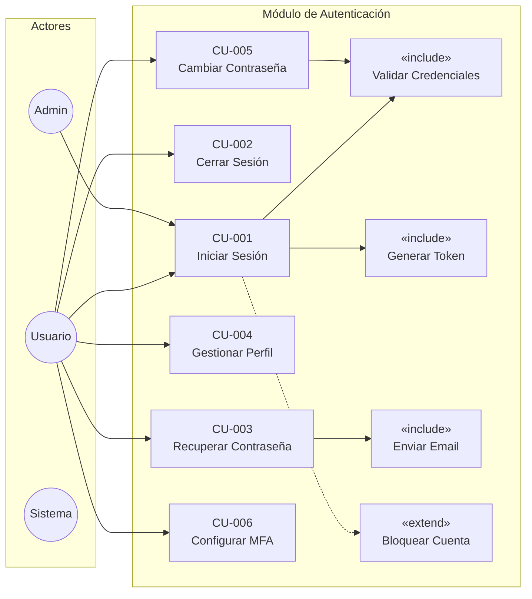
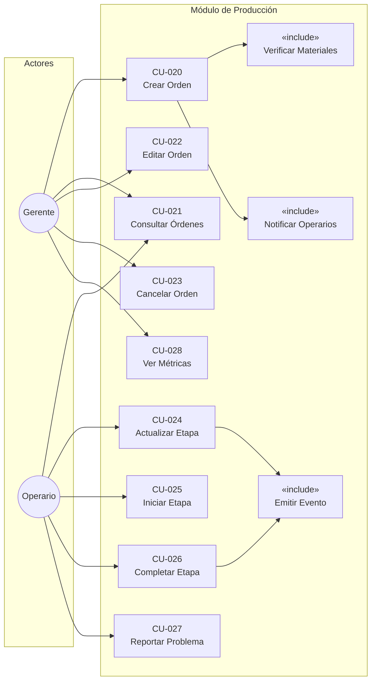
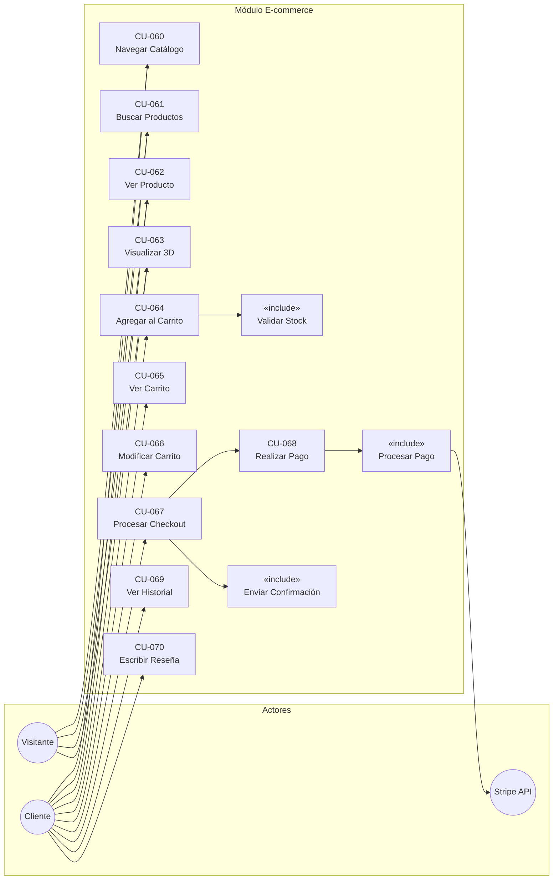

# Diagrama de Casos de Uso

**Documento ID:** UML-UC-001  
**Versión:** 1.0.0  
**Clasificación:** INTERNO  
**Fecha:** 2026-01-14  

---

## Descripción

Los diagramas de casos de uso muestran las interacciones entre actores y el sistema, representando las funcionalidades desde la perspectiva del usuario.

---

## Diagrama General del Sistema

```mermaid
graph TB
    subgraph "Actores"
        Admin(("👔 Administrador"))
        Manager(("📊 Gerente"))
        Operator(("👷 Operario"))
        Supervisor(("📋 Supervisor"))
        Customer(("🛒 Cliente"))
    end
    
    subgraph "Sistema XSafe ERP"
        subgraph "Autenticación"
            UC_Login["CU-001<br>Iniciar Sesión"]
            UC_Logout["CU-002<br>Cerrar Sesión"]
            UC_Recovery["CU-003<br>Recuperar Contraseña"]
            UC_Profile["CU-004<br>Gestionar Perfil"]
        end
        
        subgraph "Gestión de Usuarios"
            UC_CreateUser["CU-010<br>Crear Usuario"]
            UC_EditUser["CU-011<br>Editar Usuario"]
            UC_BlockUser["CU-012<br>Bloquear Usuario"]
            UC_Roles["CU-013<br>Asignar Roles"]
        end
        
        subgraph "Producción"
            UC_CreateOrder["CU-020<br>Crear Orden Producción"]
            UC_ViewOrders["CU-021<br>Consultar Órdenes"]
            UC_UpdateStage["CU-022<br>Actualizar Etapa"]
            UC_ReportIssue["CU-023<br>Reportar Problema"]
            UC_ProdMetrics["CU-024<br>Ver Métricas"]
        end
        
        subgraph "Inventario"
            UC_ViewStock["CU-030<br>Consultar Stock"]
            UC_Movement["CU-031<br>Registrar Movimiento"]
            UC_Adjust["CU-032<br>Ajustar Inventario"]
            UC_Transfer["CU-033<br>Transferir Stock"]
            UC_Alerts["CU-034<br>Gestionar Alertas"]
        end
        
        subgraph "Calidad"
            UC_Inspect["CU-040<br>Registrar Inspección"]
            UC_Defect["CU-041<br>Reportar Defecto"]
            UC_QCMetrics["CU-042<br>Ver Métricas QC"]
        end
        
        subgraph "Maquinaria"
            UC_MachStatus["CU-050<br>Ver Estado Máquinas"]
            UC_OEE["CU-051<br>Consultar OEE"]
            UC_Maintenance["CU-052<br>Solicitar Mantenimiento"]
        end
        
        subgraph "E-commerce"
            UC_Browse["CU-060<br>Navegar Catálogo"]
            UC_Cart["CU-061<br>Gestionar Carrito"]
            UC_Checkout["CU-062<br>Procesar Checkout"]
            UC_OrderHist["CU-063<br>Ver Historial"]
            UC_Review["CU-064<br>Escribir Reseña"]
        end
        
        subgraph "Reportes"
            UC_Reports["CU-070<br>Generar Reportes"]
            UC_Export["CU-071<br>Exportar Datos"]
            UC_Dashboard["CU-072<br>Ver Dashboard"]
        end
    end
    
    %% Relaciones Admin
    Admin --> UC_Login
    Admin --> UC_CreateUser
    Admin --> UC_EditUser
    Admin --> UC_BlockUser
    Admin --> UC_Roles
    Admin --> UC_Reports
    
    %% Relaciones Manager
    Manager --> UC_Login
    Manager --> UC_CreateOrder
    Manager --> UC_ViewOrders
    Manager --> UC_ProdMetrics
    Manager --> UC_ViewStock
    Manager --> UC_Adjust
    Manager --> UC_OEE
    Manager --> UC_Reports
    Manager --> UC_Dashboard
    
    %% Relaciones Operator
    Operator --> UC_Login
    Operator --> UC_ViewOrders
    Operator --> UC_UpdateStage
    Operator --> UC_ReportIssue
    Operator --> UC_ViewStock
    Operator --> UC_Movement
    
    %% Relaciones Supervisor
    Supervisor --> UC_Login
    Supervisor --> UC_Inspect
    Supervisor --> UC_Defect
    Supervisor --> UC_QCMetrics
    Supervisor --> UC_MachStatus
    
    %% Relaciones Customer
    Customer --> UC_Login
    Customer --> UC_Browse
    Customer --> UC_Cart
    Customer --> UC_Checkout
    Customer --> UC_OrderHist
    Customer --> UC_Review
```

---

## Diagrama de Casos de Uso: Módulo de Autenticación

---

## Diagrama de Casos de Uso: Módulo de Producción

---

## Diagrama de Casos de Uso: Módulo E-commerce

---

## Matriz de Casos de Uso por Actor

| Caso de Uso | Admin | Manager | Operator | Supervisor | Customer | Guest |
|-------------|-------|---------|----------|------------|----------|-------|
| Iniciar Sesión | ✅ | ✅ | ✅ | ✅ | ✅ | ❌ |
| Gestionar Usuarios | ✅ | ❌ | ❌ | ❌ | ❌ | ❌ |
| Crear Orden Producción | ✅ | ✅ | ❌ | ❌ | ❌ | ❌ |
| Actualizar Etapa | ❌ | ❌ | ✅ | ❌ | ❌ | ❌ |
| Registrar Inspección | ❌ | ❌ | ❌ | ✅ | ❌ | ❌ |
| Consultar Stock | ✅ | ✅ | ✅ | ✅ | ❌ | ❌ |
| Navegar Catálogo | ❌ | ❌ | ❌ | ❌ | ✅ | ✅ |
| Procesar Checkout | ❌ | ❌ | ❌ | ❌ | ✅ | ❌ |
| Ver Dashboard | ✅ | ✅ | ❌ | ❌ | ❌ | ❌ |
| Generar Reportes | ✅ | ✅ | ❌ | ❌ | ❌ | ❌ |

---

## Trazabilidad

| Caso de Uso | Requisito | Código Fuente | Manual Usuario |
|-------------|-----------|---------------|----------------|
| CU-001 Iniciar Sesión | REQ-AUTH-001 | `auth.service.ts:login()` | Sección 3.1 |
| CU-020 Crear Orden | REQ-PROD-001 | `production.service.ts:createOrder()` | Sección 4.2.2 |
| CU-067 Procesar Checkout | REQ-ECOM-003 | `checkout.service.ts:process()` | Sección 8.3 |

---

*Notación: UML 2.5 - Use Case Diagram*
