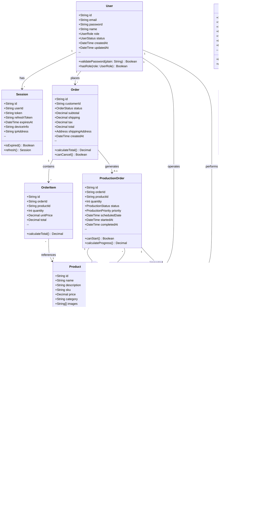
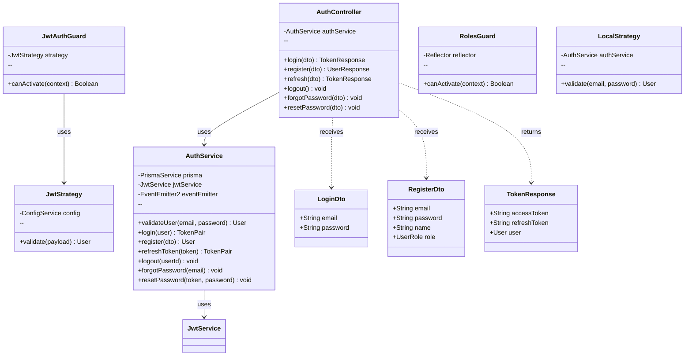

# Diagrama de Clases

**Documento ID:** UML-CLS-001  
**Versión:** 1.0.0  
**Clasificación:** INTERNO  
**Fecha:** 2026-01-14  

---

## Descripción

El diagrama de clases muestra la estructura estática del sistema, incluyendo entidades, sus atributos, métodos y relaciones.

---

## Diagrama de Clases: Dominio Principal

---

## Diagrama de Clases: Módulo de Autenticación

---

## Diagrama de Clases: Módulo de Producción

---

## Enumeraciones

---

## Clases de Infraestructura

---

## Trazabilidad

| Clase | Archivo | Schema Prisma |
|-------|---------|---------------|
| `User` | `shared/prisma/schema.prisma` | `model User` |
| `Product` | `shared/prisma/schema.prisma` | `model Product` |
| `Order` | `shared/prisma/schema.prisma` | `model Order` |
| `ProductionOrder` | `shared/prisma/schema.prisma` | `model ProductionOrder` |
| `AuthService` | `modules/auth/auth.service.ts` | - |
| `ProductionService` | `modules/production/production.service.ts` | - |

---

*Notación: UML 2.5 - Class Diagram*
