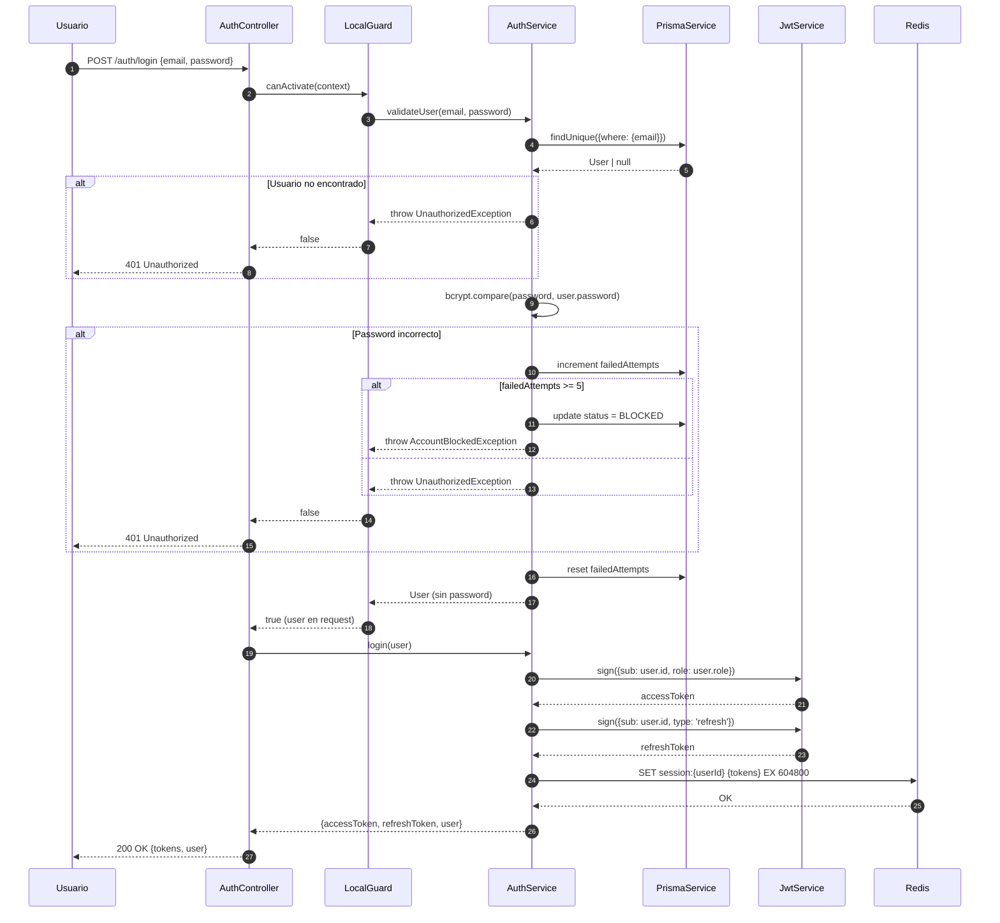
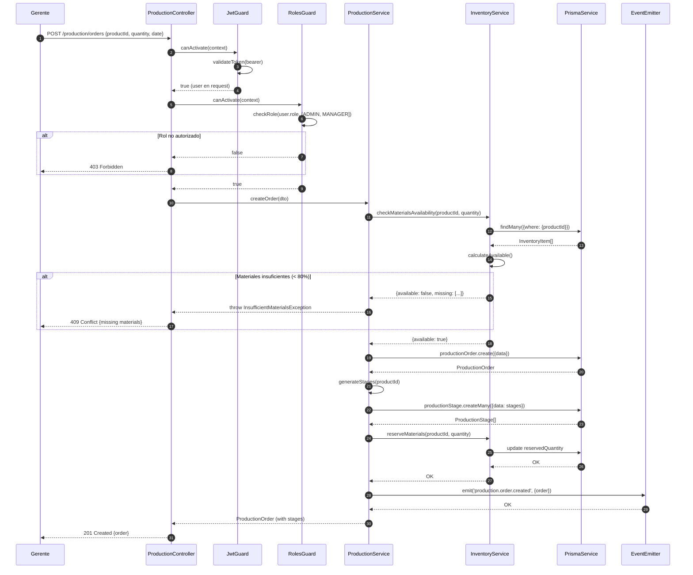
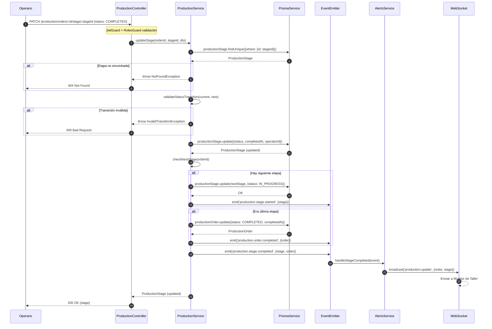
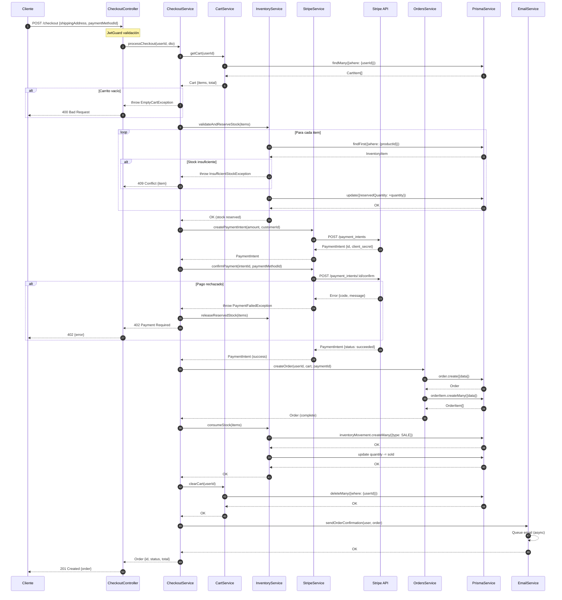
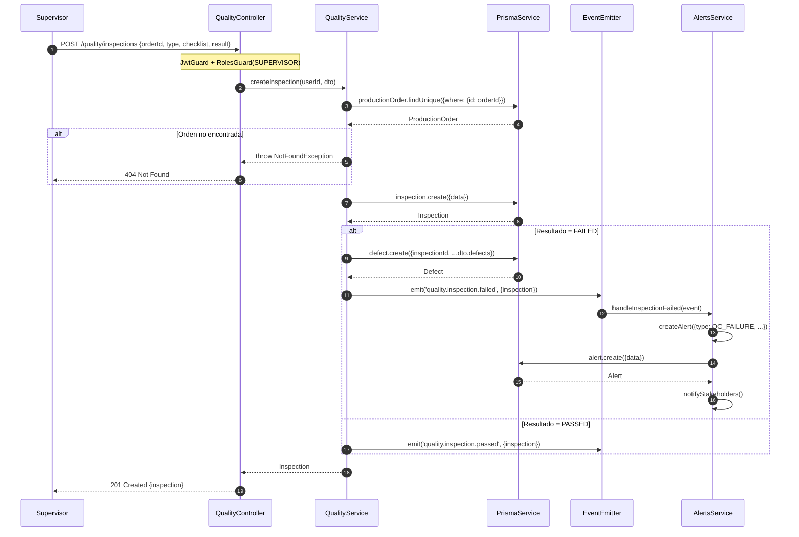
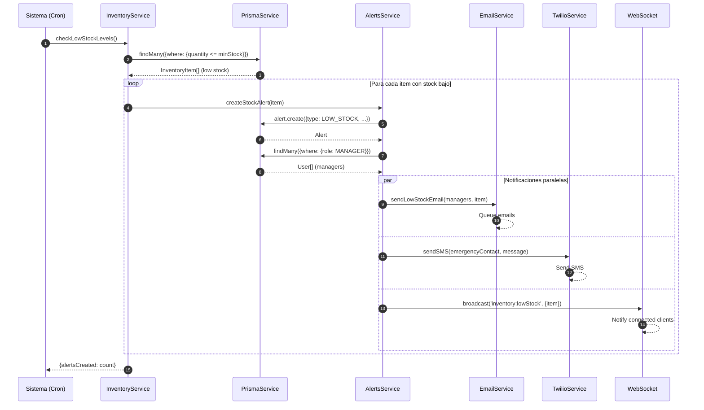

# Diagramas de Secuencia

**Documento ID:** UML-SEQ-001  
**Versión:** 1.0.0  
**Clasificación:** INTERNO  
**Fecha:** 2026-01-14  

---

## Descripción

Los diagramas de secuencia muestran las interacciones entre objetos a lo largo del tiempo, representando el flujo de mensajes para escenarios específicos.

---

## SEC-001: Flujo de Autenticación (Login)

---

## SEC-002: Flujo de Creación de Orden de Producción

---

## SEC-003: Flujo de Actualización de Etapa (Operario)

---

## SEC-004: Flujo de Checkout E-commerce

---

## SEC-005: Flujo de Registro de Inspección de Calidad

---

## SEC-006: Flujo de Alerta de Stock Bajo

---

## Trazabilidad

| Diagrama | Caso de Uso | Componentes |
|----------|-------------|-------------|
| SEC-001 | CU-AUTH-001 | AuthController, AuthService, JwtService |
| SEC-002 | CU-PROD-001 | ProductionController, ProductionService, InventoryService |
| SEC-003 | CU-PROD-002 | ProductionController, ProductionService, EventEmitter |
| SEC-004 | CU-ECOM-002 | CheckoutController, CheckoutService, StripeService |
| SEC-005 | CU-QC-001 | QualityController, QualityService, AlertsService |
| SEC-006 | - (Proceso automático) | InventoryService, AlertsService |

---

*Notación: UML 2.5 - Sequence Diagram*
