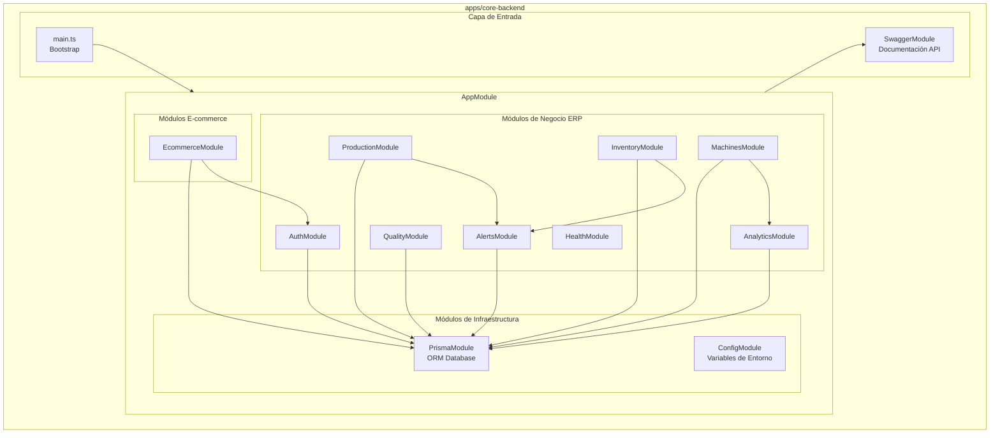
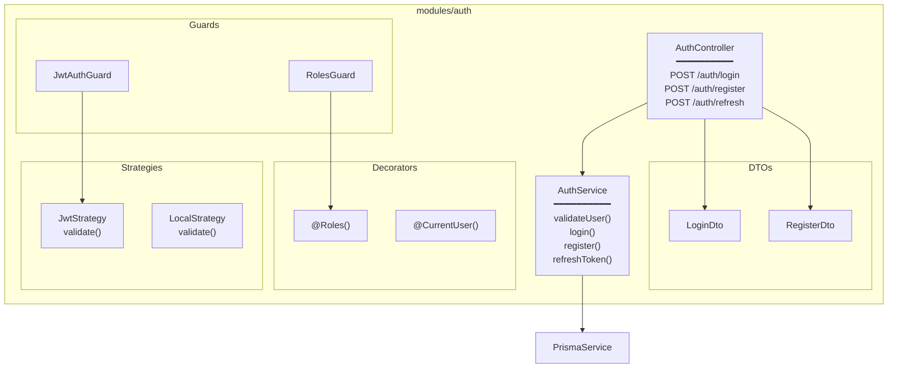
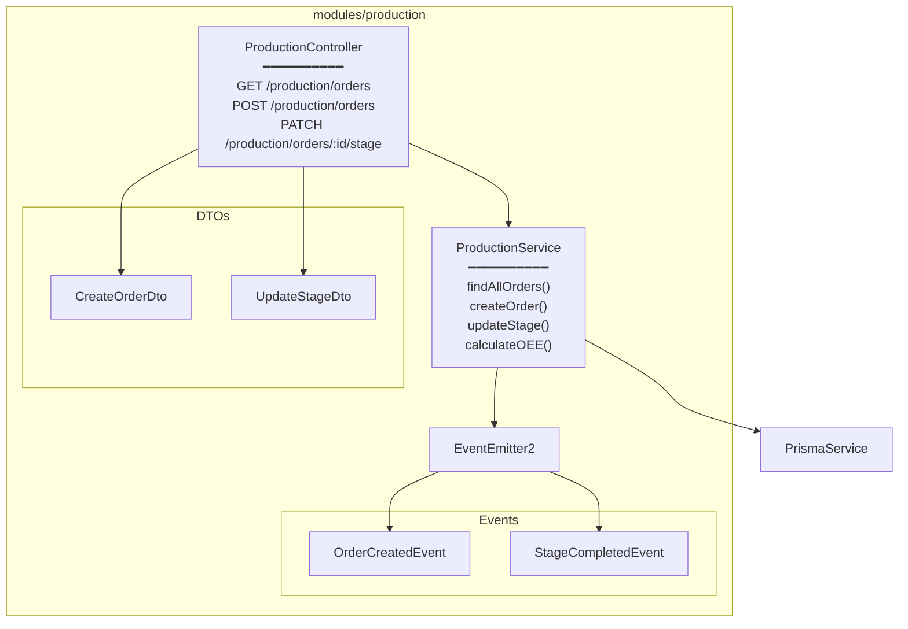
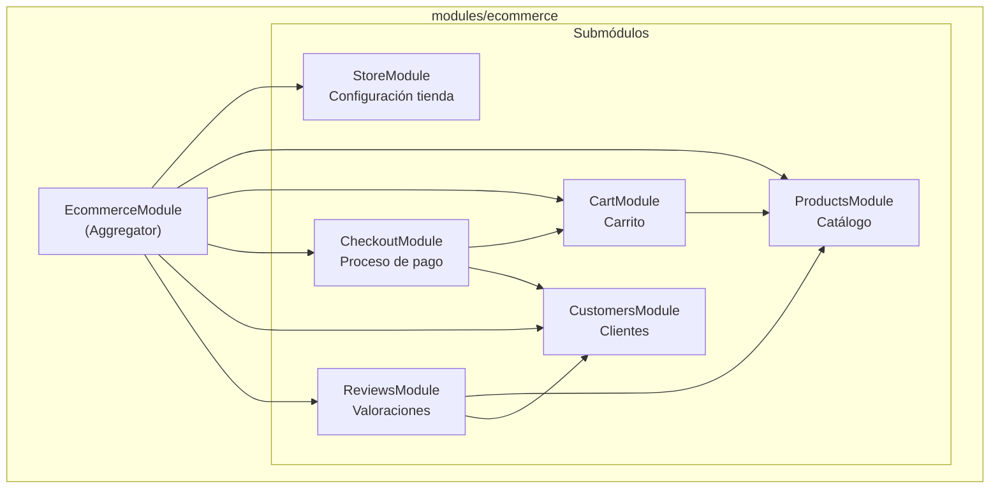

# Diagrama de Componentes

**Documento ID:** UML-CMP-001  
**Versión:** 1.0.0  
**Clasificación:** INTERNO  
**Fecha:** 2026-01-14  

---

## Descripción

El Diagrama de Componentes muestra la estructura interna del backend, las dependencias entre módulos, y los puntos de integración.

## Diagrama Principal - Backend API

## Diagrama Detallado - AuthModule

## Diagrama Detallado - ProductionModule

## Diagrama Detallado - EcommerceModule

## Matriz de Dependencias

| Módulo | Depende De | Dependido Por |
|--------|------------|---------------|
| `ConfigModule` | - | Todos |
| `PrismaModule` | `ConfigModule` | Todos los de negocio |
| `AuthModule` | `PrismaModule` | `EcommerceModule` |
| `ProductionModule` | `PrismaModule`, `AlertsModule` | `AnalyticsModule` |
| `InventoryModule` | `PrismaModule`, `AlertsModule` | `ProductionModule` |
| `AlertsModule` | `PrismaModule` | `Production`, `Inventory`, `Machines` |
| `EcommerceModule` | `AuthModule`, `PrismaModule` | - |

## Interfaces Expuestas (APIs)

| Módulo | Base Path | Endpoints | Auth Required |
|--------|-----------|-----------|---------------|
| Auth | `/auth` | 4 | Parcial |
| Production | `/production` | 8 | Sí (RBAC) |
| Inventory | `/inventory` | 6 | Sí (RBAC) |
| Quality | `/quality` | 5 | Sí (RBAC) |
| Machines | `/machines` | 4 | Sí (RBAC) |
| Analytics | `/analytics` | 3 | Sí (ADMIN) |
| Health | `/health` | 2 | No |
| Store | `/store` | 3 | Parcial |
| Products | `/products` | 5 | Parcial |
| Cart | `/cart` | 4 | Sí |
| Checkout | `/checkout` | 2 | Sí |

---

## Trazabilidad

| Componente | Ubicación |
|------------|-----------|
| AppModule | `apps/core-backend/src/app.module.ts:14-35` |
| AuthModule | `apps/core-backend/src/modules/auth/auth.module.ts` |
| ProductionModule | `apps/core-backend/src/modules/production/production.module.ts` |
| EcommerceModule | `apps/core-backend/src/modules/ecommerce/ecommerce.module.ts` |

---

*Notación: UML 2.5 - Component Diagram*
