# Diagrama de Despliegue

**Documento ID:** UML-DEP-001  
**Versión:** 1.0.0  
**Clasificación:** CONFIDENCIAL  
**Fecha:** 2026-01-14  

---

## Descripción

El Diagrama de Despliegue muestra la topología de infraestructura física y la distribución de artefactos de software en el entorno de producción.

## Diagrama de Infraestructura Completa

```mermaid
graph TB
    subgraph "Internet"
        Browser["🌐 Navegador Web"]
        MobileApp["📱 App Móvil"]
        DesktopApp["💻 App Escritorio"]
    end
    
    subgraph "AWS Cloud - us-east-1"
        subgraph "Edge Layer"
            Route53["Route 53<br>DNS"]
            CloudFront["CloudFront<br>CDN"]
            WAF["WAF<br>Firewall"]
        end
        
        subgraph "VPC Production (10.0.0.0/16)"
            subgraph "Public Subnets (10.0.1.0/24)"
                ALB["Application<br>Load Balancer<br>━━━━━━━━━━<br>HTTPS:443"]
                NAT["NAT Gateway"]
            end
            
            subgraph "Private Subnets - Compute (10.0.10.0/24)"
                subgraph "ECS Cluster"
                    API1["API Task 1<br>━━━━━━━━━━<br>2 vCPU<br>4GB RAM<br>Port 3000"]
                    API2["API Task 2<br>━━━━━━━━━━<br>2 vCPU<br>4GB RAM<br>Port 3000"]
                    API3["API Task 3<br>━━━━━━━━━━<br>2 vCPU<br>4GB RAM<br>Port 3000"]
                end
            end
            
            subgraph "Private Subnets - Data (10.0.20.0/24)"
                RDS["RDS PostgreSQL<br>━━━━━━━━━━<br>db.r5.large<br>Multi-AZ<br>100GB SSD"]
                RDSReplica["RDS Read Replica<br>━━━━━━━━━━<br>db.r5.large<br>Read-only"]
                Redis["ElastiCache Redis<br>━━━━━━━━━━<br>cache.r5.large<br>Cluster Mode"]
            end
        end
        
        subgraph "Storage"
            S3Assets["S3 Bucket<br>━━━━━━━━━━<br>xsafe-assets<br>3D Models, Images"]
            S3Backup["S3 Bucket<br>━━━━━━━━━━<br>xsafe-backups<br>DB Snapshots"]
        end
        
        subgraph "Security & Config"
            SecretsManager["Secrets Manager<br>━━━━━━━━━━<br>DB Credentials<br>API Keys"]
            SSM["Parameter Store<br>━━━━━━━━━━<br>Config Values"]
        end
        
        subgraph "Monitoring"
            CloudWatch["CloudWatch<br>━━━━━━━━━━<br>Logs<br>Metrics<br>Alarms"]
            XRay["X-Ray<br>━━━━━━━━━━<br>Distributed Tracing"]
        end
    end
    
    subgraph "External Hosting"
        Vercel["Vercel<br>━━━━━━━━━━<br>E-commerce Frontend<br>ERP Web Admin"]
    end
    
    subgraph "External Services"
        Stripe["Stripe API"]
        SendGrid["SendGrid API"]
        GitHub["GitHub Actions"]
    end
    
    %% Connections
    Browser --> CloudFront
    Browser --> Vercel
    MobileApp --> CloudFront
    DesktopApp --> CloudFront
    
    CloudFront --> WAF
    WAF --> ALB
    Vercel --> CloudFront
    
    ALB --> API1
    ALB --> API2
    ALB --> API3
    
    API1 --> RDS
    API1 --> Redis
    API1 --> S3Assets
    API1 --> SecretsManager
    
    RDS --> RDSReplica
    RDS --> S3Backup
    
    API1 --> CloudWatch
    API1 --> XRay
    
    API1 --> Stripe
    API1 --> SendGrid
    
    GitHub --> ECS
```

## Especificaciones de Nodos

### Capa de Computación

| Nodo | Especificación | Cantidad | Auto-Scaling |
|------|----------------|----------|--------------|
| **ECS Task** | 2 vCPU, 4GB RAM, ARM64 | 2-10 | Sí (CPU > 70%) |
| **ALB** | Application Load Balancer | 1 | Automático |
| **NAT Gateway** | Salida a Internet | 2 (HA) | N/A |

### Capa de Datos

| Nodo | Especificación | Storage | Backup |
|------|----------------|---------|--------|
| **RDS Primary** | db.r5.large (2vCPU, 16GB) | 100GB gp3 | Daily + PITR |
| **RDS Replica** | db.r5.large (2vCPU, 16GB) | 100GB gp3 | N/A |
| **ElastiCache** | cache.r5.large (2vCPU, 13GB) | N/A | N/A |

### Almacenamiento

| Bucket | Propósito | Clase | Lifecycle |
|--------|-----------|-------|-----------|
| `xsafe-assets` | Assets estáticos | S3 Intelligent-Tiering | 90d → IA |
| `xsafe-backups` | Snapshots DB | S3 Glacier | 30d → Glacier |

## Diagrama de Red

## Security Groups

| Nombre | Inbound | Outbound | Asociado A |
|--------|---------|----------|------------|
| `sg-alb` | 443 (0.0.0.0/0) | All | ALB |
| `sg-ecs` | 3000 (sg-lb) | All | ECS Tasks |
| `sg-rds` | 5432 (sg-ecs) | None | RDS |
| `sg-redis` | 6379 (sg-ecs) | None | ElastiCache |

## Artefactos Desplegados

| Artefacto | Versión | Ubicación | Proceso de Deploy |
|-----------|---------|-----------|-------------------|
| `xsafe-api:latest` | Semver | ECR | GitHub Actions → ECS |
| `xsafe-web` | Git SHA | Vercel | Git Push → Auto |
| `xsafe-ecommerce` | Git SHA | Vercel | Git Push → Auto |
| `xsafe-desktop` | Semver | S3/GitHub Releases | Manual Release |
| `xsafe-mobile` | Semver | App Store / Play Store | Manual Release |

## Métricas de Infraestructura

| Métrica | Objetivo | Alarma |
|---------|----------|--------|
| CPU Utilization | < 70% | > 80% durante 5min |
| Memory Utilization | < 75% | > 85% durante 5min |
| RDS Connections | < 80% max | > 90% |
| Redis Memory | < 75% | > 85% |
| ALB 5xx Errors | < 0.1% | > 1% |
| Response Time P95 | < 200ms | > 500ms |

---

## Trazabilidad

| Configuración | Archivo |
|---------------|---------|
| Docker API | `apps/core-backend/Dockerfile` |
| ECS Task Definition | `infrastructure/ecs-task.json` |
| CloudFormation | `infrastructure/cfn-stack.yaml` |
| GitHub Actions | `.github/workflows/deploy.yml` |

---

*Notación: UML 2.5 - Deployment Diagram con extensiones AWS*
