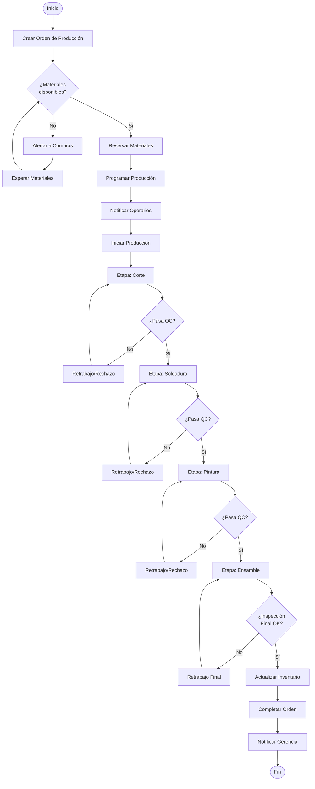
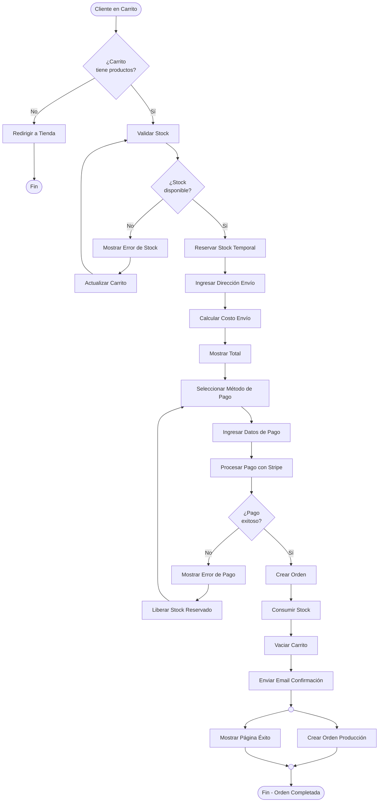
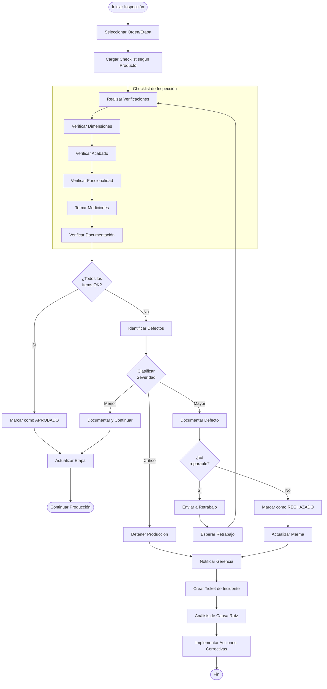
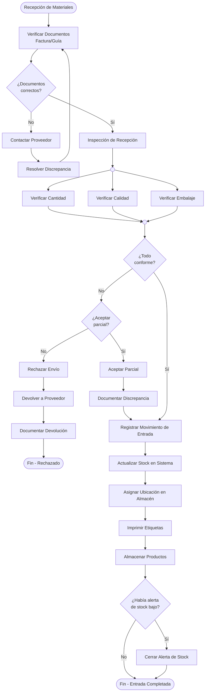
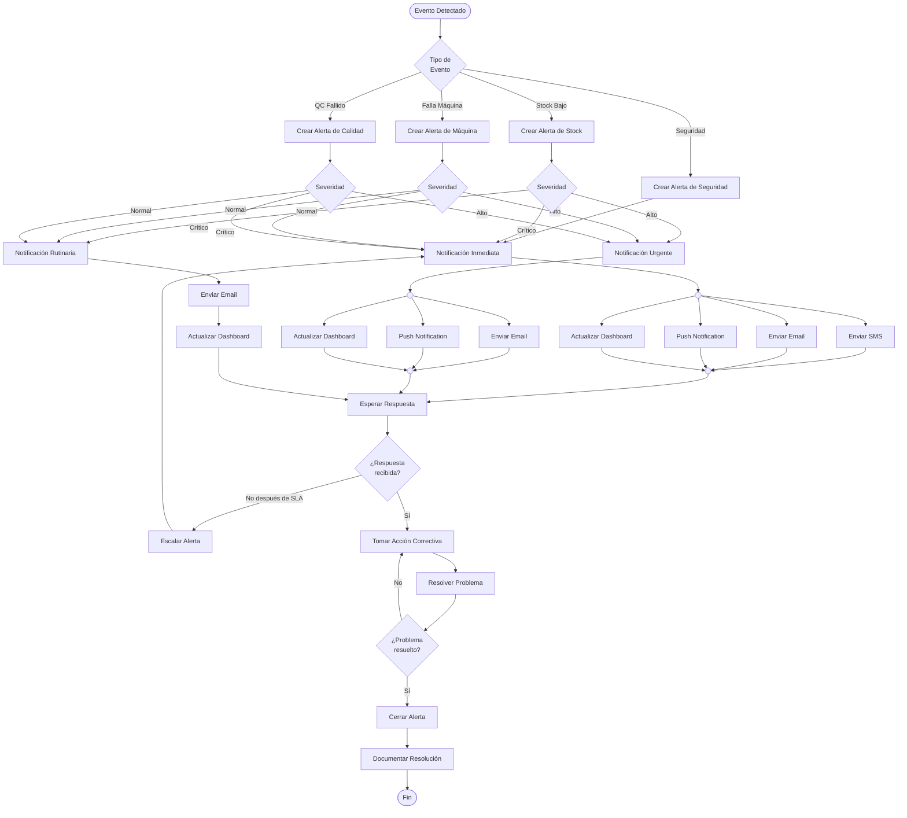

# Diagramas de Actividades

**Documento ID:** UML-ACT-001  
**Versión:** 1.0.0  
**Clasificación:** INTERNO  
**Fecha:** 2026-01-14  

---

## Descripción

Los diagramas de actividades modelan flujos de trabajo y procesos de negocio, mostrando actividades, decisiones y flujos paralelos.

---

## ACT-001: Proceso de Orden de Producción

---

## ACT-002: Proceso de Checkout E-commerce

---

## ACT-003: Proceso de Inspección de Calidad

---

## ACT-004: Proceso de Gestión de Inventario (Entrada de Materiales)

---

## ACT-005: Proceso de Alerta y Respuesta

---

## Trazabilidad

| Diagrama | Proceso de Negocio | Módulos Involucrados |
|----------|-------------------|----------------------|
| ACT-001 | Fabricación de productos | Production, Inventory, Quality |
| ACT-002 | Venta online | E-commerce, Inventory, Production |
| ACT-003 | Control de calidad | Quality, Production, Alerts |
| ACT-004 | Recepción de materiales | Inventory, Alerts |
| ACT-005 | Gestión de alertas | Alerts, todos los módulos |

---

*Notación: UML 2.5 - Activity Diagram*
