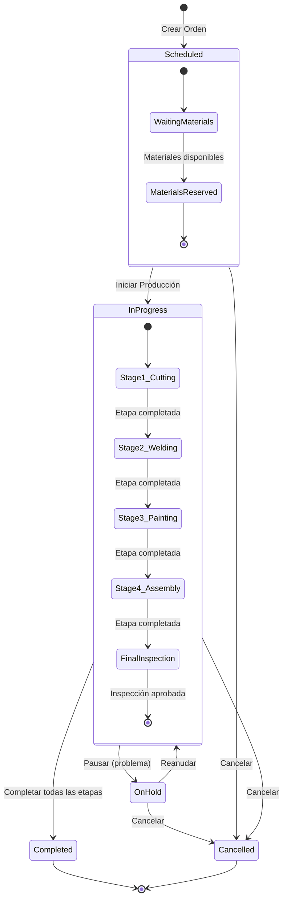
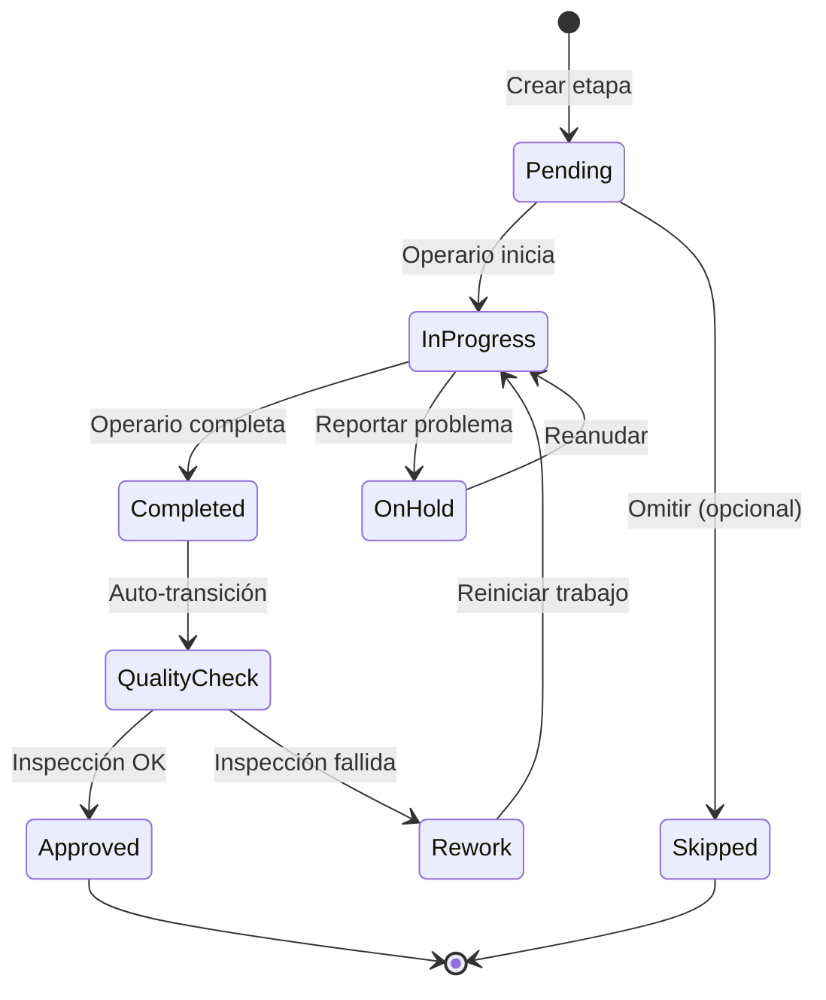
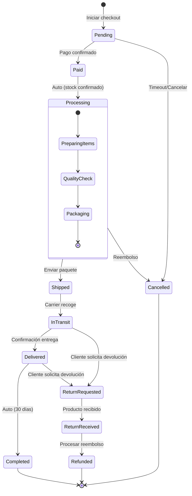
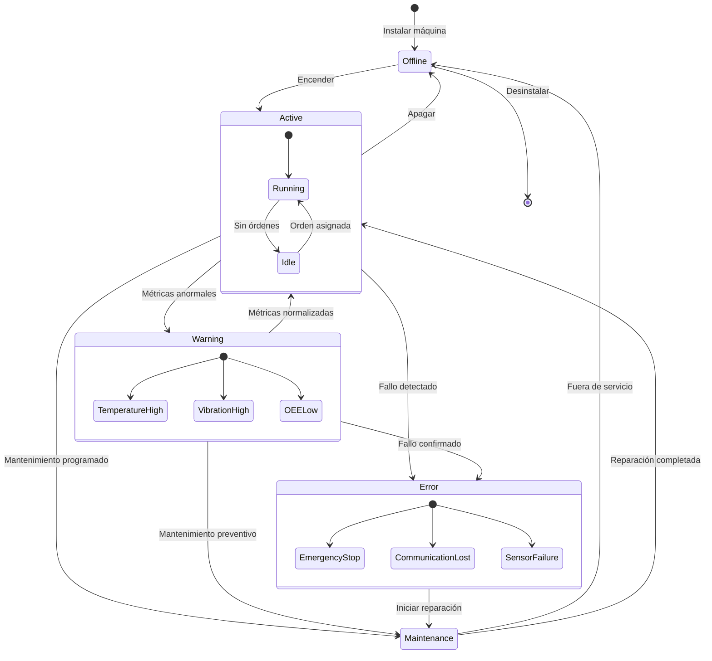
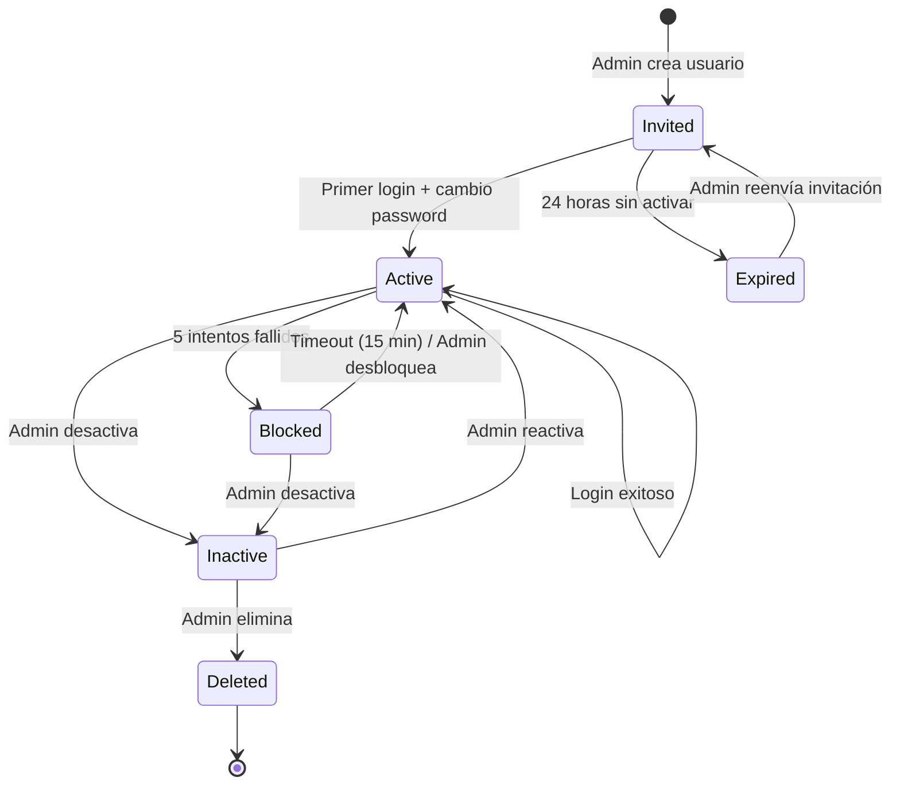
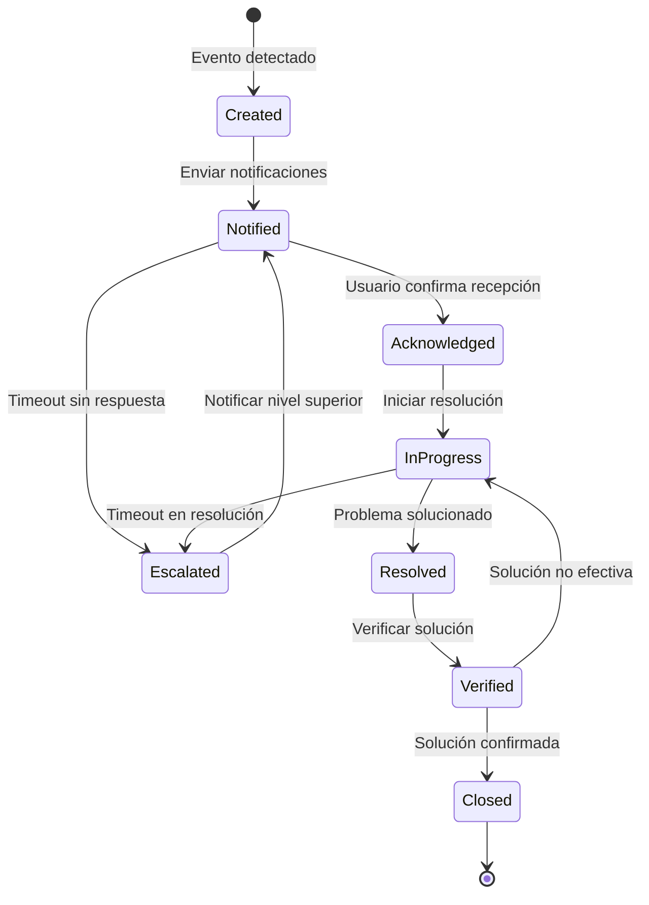

# Diagramas de Estados

**Documento ID:** UML-ST-001  
**Versión:** 1.0.0  
**Clasificación:** INTERNO  
**Fecha:** 2026-01-14  

---

## Descripción

Los diagramas de estados modelan el ciclo de vida de entidades clave del sistema, mostrando estados, transiciones y eventos que las disparan.

---

## ST-001: Ciclo de Vida de Orden de Producción

### Tabla de Transiciones

| Estado Origen | Estado Destino | Evento | Condición | Acción |
|---------------|----------------|--------|-----------|--------|
| - | Scheduled | createOrder() | Materiales > 80% | Reservar materiales |
| Scheduled | InProgress | startProduction() | Fecha = hoy | Notificar operarios |
| Scheduled | Cancelled | cancelOrder() | status != IN_PROGRESS | Liberar reservas |
| InProgress | OnHold | pauseOrder() | Problema reportado | Crear alerta |
| InProgress | Completed | completeStage() | Última etapa + QC OK | Actualizar inventario |
| OnHold | InProgress | resumeOrder() | Problema resuelto | - |
| OnHold | Cancelled | cancelOrder() | - | Liberar reservas |

---

## ST-002: Ciclo de Vida de Etapa de Producción

### Tabla de Transiciones

| Estado Origen | Estado Destino | Evento | Actor | Duración Máxima |
|---------------|----------------|--------|-------|-----------------|
| Pending | InProgress | startStage() | Operario | - |
| InProgress | Completed | completeStage() | Operario | 4 horas |
| InProgress | OnHold | reportIssue() | Operario | - |
| Completed | QualityCheck | - (auto) | Sistema | 30 minutos |
| QualityCheck | Approved | approveInspection() | Supervisor | - |
| QualityCheck | Rework | rejectInspection() | Supervisor | - |

---

## ST-003: Ciclo de Vida de Pedido E-commerce

### Tabla de Transiciones

| Estado Origen | Estado Destino | Evento | Tiempo Máximo |
|---------------|----------------|--------|---------------|
| Pending | Paid | stripeWebhook(payment_intent.succeeded) | 30 min |
| Pending | Cancelled | timeout / user_cancel | - |
| Paid | Processing | - (auto) | Inmediato |
| Processing | Shipped | shipOrder() | 3 días |
| Shipped | InTransit | carrierUpdate() | 1 día |
| InTransit | Delivered | carrierDelivered() | 7 días |
| Delivered | Completed | - (auto) | 30 días |

---

## ST-004: Ciclo de Vida de Máquina

### Tabla de Transiciones

| Estado Origen | Estado Destino | Evento | Alerta |
|---------------|----------------|--------|--------|
| Active | Warning | metric.abnormal | Email + Push |
| Warning | Error | metric.critical | SMS + Email + Push |
| Active | Maintenance | maintenance.scheduled | Email |
| Error | Maintenance | maintenance.start | - |
| Maintenance | Active | maintenance.complete | Email |

---

## ST-005: Ciclo de Vida de Usuario

### Tabla de Transiciones

| Estado Origen | Estado Destino | Evento | Actor |
|---------------|----------------|--------|-------|
| - | Invited | createUser() | Admin |
| Invited | Active | firstLogin() + changePassword() | Usuario |
| Invited | Expired | - (auto 24h) | Sistema |
| Active | Blocked | failedLogin() × 5 | Sistema |
| Blocked | Active | - (auto 15min) | Sistema |
| Active | Inactive | deactivateUser() | Admin |
| Inactive | Deleted | deleteUser() | Admin |

---

## ST-006: Ciclo de Vida de Alerta

### SLA por Severidad

| Severidad | Tiempo para Acknowledge | Tiempo para Resolución |
|-----------|-------------------------|------------------------|
| Crítico | 15 minutos | 4 horas |
| Alto | 1 hora | 24 horas |
| Medio | 4 horas | 72 horas |
| Bajo | 24 horas | 1 semana |

---

## Trazabilidad

| Diagrama | Entidad | Modelo Prisma | Service |
|----------|---------|---------------|---------|
| ST-001 | ProductionOrder | `model ProductionOrder` | `ProductionService` |
| ST-002 | ProductionStage | `model ProductionStage` | `ProductionService` |
| ST-003 | Order | `model Order` | `OrdersService` |
| ST-004 | Machine | `model Machine` | `MachinesService` |
| ST-005 | User | `model User` | `AuthService` |
| ST-006 | Alert | `model Alert` | `AlertsService` |

---

*Notación: UML 2.5 - State Machine Diagram*
