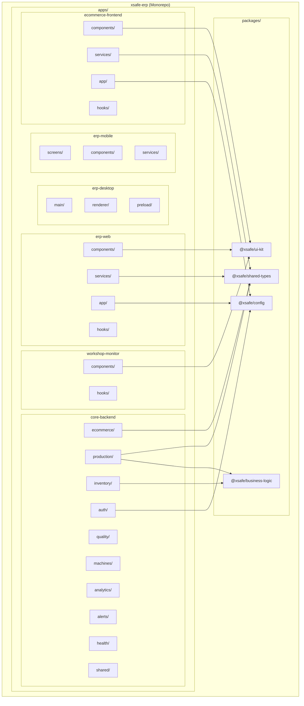
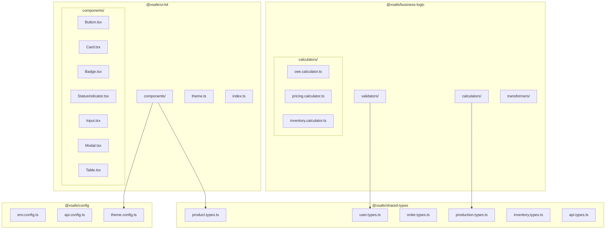
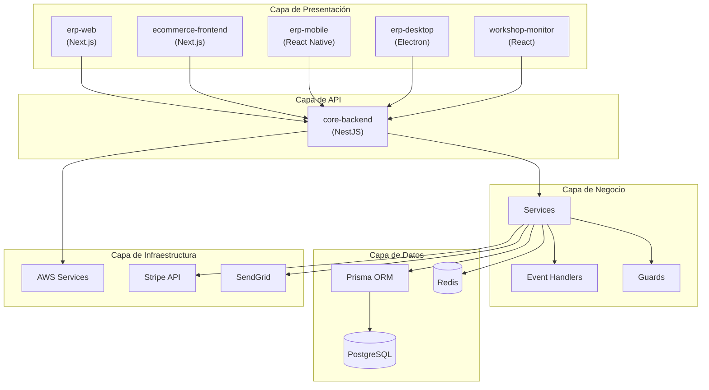

# Diagrama de Paquetes

**Documento ID:** UML-PKG-001  
**Versión:** 1.0.0  
**Clasificación:** INTERNO  
**Fecha:** 2026-01-14  

---

## Descripción

El diagrama de paquetes muestra la organización del sistema en módulos de alto nivel y sus dependencias.

---

## Diagrama de Paquetes del Monorepo

---

## Diagrama de Paquetes: Backend

```mermaid
graph TB
    subgraph "core-backend/src"
        AppModule["app.module.ts"]
        
        subgraph "modules/"
            subgraph "auth/"
                AuthModule["auth.module"]
                AuthController["auth.controller"]
                AuthService["auth.service"]
                AuthGuards["guards/"]
                AuthStrategies["strategies/"]
                AuthDecorators["decorators/"]
                AuthDto["dto/"]
            end
            
            subgraph "production/"
                ProdModule["production.module"]
                ProdController["production.controller"]
                ProdService["production.service"]
                ProdEvents["events/"]
                ProdDto["dto/"]
            end
            
            subgraph "inventory/"
                InvModule["inventory.module"]
                InvController["inventory.controller"]
                InvService["inventory.service"]
                InvListeners["listeners/"]
                InvDto["dto/"]
            end
            
            subgraph "quality/"
                QCModule["quality.module"]
                QCController["quality.controller"]
                QCService["quality.service"]
                QCDto["dto/"]
            end
            
            subgraph "machines/"
                MachModule["machines.module"]
                MachController["machines.controller"]
                MachService["machines.service"]
                MachDto["dto/"]
            end
            
            subgraph "ecommerce/"
                EcomModule["ecommerce.module"]
                
                subgraph "products/"
                    ProductsService["products.service"]
                end
                
                subgraph "cart/"
                    CartService["cart.service"]
                end
                
                subgraph "checkout/"
                    CheckoutService["checkout.service"]
                    StripeService["stripe.service"]
                end
                
                subgraph "customers/"
                    CustomersService["customers.service"]
                end
                
                subgraph "reviews/"
                    ReviewsService["reviews.service"]
                end
            end
            
            subgraph "alerts/"
                AlertsModule["alerts.module"]
                AlertsService["alerts.service"]
            end
            
            subgraph "analytics/"
                AnalyticsModule["analytics.module"]
                AnalyticsService["analytics.service"]
            end
        end
        
        subgraph "shared/"
            PrismaModule["prisma/"]
            Interceptors["interceptors/"]
            Filters["filters/"]
            Pipes["pipes/"]
        end
        
        subgraph "config/"
            DatabaseConfig["database.config"]
            JwtConfig["jwt.config"]
            AppConfig["app.config"]
        end
    end
    
    %% Dependencies
    AppModule --> AuthModule
    AppModule --> ProdModule
    AppModule --> InvModule
    AppModule --> QCModule
    AppModule --> MachModule
    AppModule --> EcomModule
    AppModule --> AlertsModule
    AppModule --> AnalyticsModule
    AppModule --> PrismaModule
    
    ProdModule --> AlertsModule
    ProdModule --> PrismaModule
    
    InvModule --> AlertsModule
    InvModule --> PrismaModule
    
    EcomModule --> AuthModule
    EcomModule --> PrismaModule
    
    CheckoutService --> StripeService
    
    MachModule --> AnalyticsModule
```

---

## Diagrama de Paquetes: Shared Packages

---

## Matriz de Dependencias

| Paquete | Depende De | Dependido Por |
|---------|------------|---------------|
| `@xsafe/ui-kit` | `@xsafe/shared-types`, `@xsafe/config` | erp-web, ecommerce-frontend, workshop-monitor |
| `@xsafe/shared-types` | - | Todos |
| `@xsafe/business-logic` | `@xsafe/shared-types` | core-backend |
| `@xsafe/config` | - | Todos |
| `auth` | `shared/prisma`, `config` | `ecommerce` |
| `production` | `shared/prisma`, `alerts` | `analytics` |
| `inventory` | `shared/prisma`, `alerts` | `production` |
| `ecommerce` | `auth`, `shared/prisma` | - |
| `alerts` | `shared/prisma` | `production`, `inventory`, `machines` |

---

## Capas Arquitectónicas

---

## Trazabilidad

| Paquete | Ubicación | package.json |
|---------|-----------|--------------|
| @xsafe/ui-kit | `packages/ui-kit/` | `@xsafe/ui-kit` |
| @xsafe/shared-types | `packages/shared-types/` | `@xsafe/shared-types` |
| @xsafe/business-logic | `packages/business-logic/` | `@xsafe/business-logic` |
| @xsafe/config | `packages/config/` | `@xsafe/config` |
| core-backend | `apps/core-backend/` | `@xsafe/core-backend` |

---

*Notación: UML 2.5 - Package Diagram*
